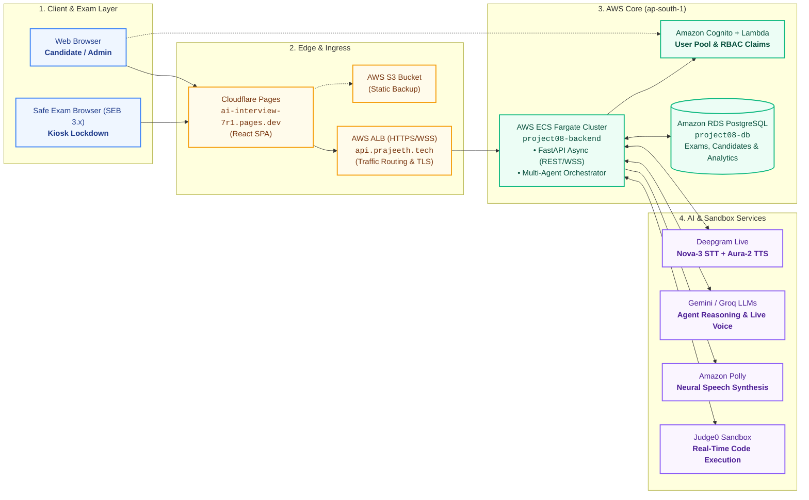
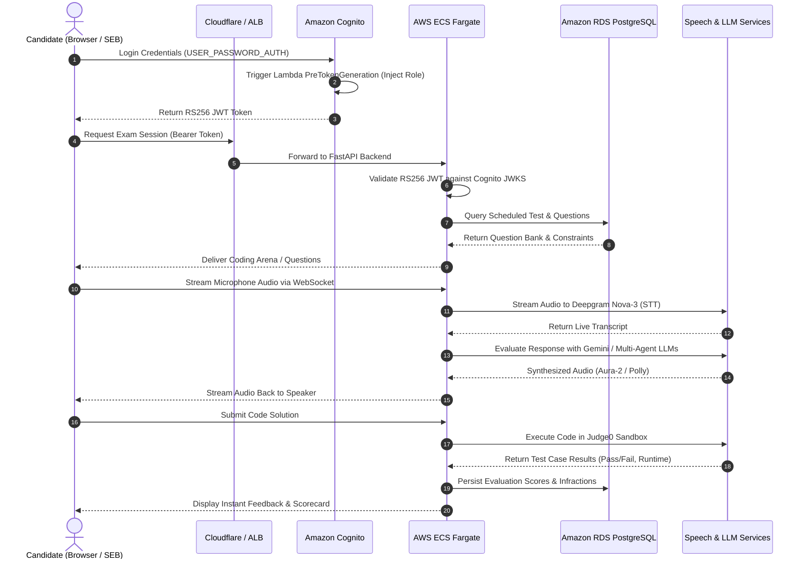

# AWS System Design & Deployment Architecture

This document provides a concise, presentation-ready architectural breakdown of the **AI Interviewer & Assessment Platform** deployed on **Amazon Web Services (AWS)** in the **`ap-south-1` (Mumbai)** region.

---

## 1. High-Level Architecture Diagram (PPT Slide Ready)

> [!TIP]
> **Slide Recommendation**: Designed cleanly with 4 distinct horizontal tiers to fit standard 16:9 presentation slides without visual clutter.



---

## 2. Minimal Text Blueprint (Slide Copy-Paste)

```
========================================================================================
                      AWS PRODUCTION SYSTEM ARCHITECTURE (ap-south-1)
========================================================================================

  [ CLIENTS ]               [ EDGE & INGRESS ]             [ COMPUTE & PERSISTENCE ]
  • React SPA (Vite)   ---> • Cloudflare Pages (CDN)  ---> • AWS Application Load Balancer
  • Safe Exam Browser       • Amazon S3 Static Backup        (api.prajeeth.tech / WSS)
    (SEB 3.x Kiosk)                                                    |
                                                                       v
  [ AUTHENTICATION ]                                       • AWS ECS Fargate Cluster
  • Amazon Cognito User Pool                                 (project08-backend / Python Async)
  • AWS Lambda Trigger (PreTokenGen RBAC)                              |
                                                              +--------+--------+
                                                              |                 |
  [ PERSISTENCE ]                                             v                 v
  • Amazon RDS PostgreSQL (project08-db)                [ AI & VOICE ]    [ CODE EXEC ]
  • Candidate Attempts, Test Banks, Analytics           • Deepgram Nova-3 • Judge0 Sandbox
                                                        • Aura-2 / Polly
                                                        • Gemini Live API
========================================================================================
```

---

## 3. Active AWS Services & Production Inventory

| AWS Service | Production Identifier | Purpose & Active Implementation |
|---|---|---|
| **AWS ECS on Fargate** | Cluster: `project08`<br/>Service: `backend` | **Serverless Container Execution**. Runs FastAPI asynchronous backend without managing EC2 instances. |
| **Amazon ECR** | Repo: `project08-backend`<br/>Account: `975903044204` | **Container Registry**. Stores production Docker images tagged with git commit SHAs. |
| **Amazon RDS PostgreSQL** | `project08-db.c78so622uwyk.ap-south-1.rds.amazonaws.com:5432` | **Relational Data Persistence**. Stores formal exams, questions, submissions, test allocations, and scorecards. |
| **Amazon Cognito** | User Pool: `ap-south-1_NfT5QjYyc`<br/>Client ID: `75d387dgejug1fgukvna0agrf0` | **Identity & Access Management**. Issues RS256 JWT tokens with role claims (`candidate`, `faculty`, `admin`). |
| **AWS Lambda** | Function: `project08-cognito-role-trigger` | **PreTokenGeneration Hook**. Injects verified custom roles into Cognito ID tokens during login. |
| **Application Load Balancer (ALB)** | `p08-alb-1459152437.ap-south-1.elb.amazonaws.com` | **Traffic Routing & TLS Termination**. Distributes REST & WebSocket traffic to ECS Fargate tasks. |
| **Amazon S3** | Bucket: `project08-frontend-975903044204` | **Immutable Asset Backup**. Holds static frontend build mirrors synced on deployment. |
| **Amazon Polly** | Engine: `neural` (Gregory / Danielle) | **Neural Speech Synthesis (TTS)** fallback for conversational voice interviews. |

---

## 4. Current AI Models & Voice Engine Stack

| Component | Active Engine / Model | Role in Platform |
|---|---|---|
| **Speech-to-Text (STT)** | **Deepgram Nova-3** (`nova-3`) | Real-time streaming transcription with ultra-low latency (<300ms). |
| **Text-to-Speech (TTS)** | **Deepgram Aura-2** (`aura-2-asteria-en`) & **Amazon Polly** | Natural, expressive conversational audio synthesis. |
| **Multimodal Real-Time Voice** | **Google Gemini Live** (`gemini-3.8-live`, voice `Aoede`) | Direct bidirectional audio streaming and live voice reasoning. |
| **Core Reasoning & Evaluation** | **Gemini 1.5 Flash** / **OpenAI-compatible LLMs** | Multi-agent rubric scoring, code analysis, and interview question formulation. |
| **Code Execution Sandbox** | **Judge0 CE** (`judge0-ce.p.rapidapi.com`) | Isolated sandbox executing candidate code across Python, C++, Java, JS. |
| **Secure Examination Client** | **Safe Exam Browser (SEB 3.10.2)** | Native OS kiosk lockdown preventing secondary tabs, virtual desktops, or cheating. |

---

## 5. End-to-End Interview & Assessment Flow



---

## 6. Slide Talking Points for Presentation / Viva

1. **Serverless & Scalable (ECS Fargate + RDS)**:
   - Zero EC2 instance management — infrastructure scales automatically based on active candidate test sessions.
   - Hosted in **AWS `ap-south-1` (Mumbai)** ensuring minimal round-trip latency for audio streaming.

2. **Enterprise Grade Identity (Cognito + Lambda PreTokenGeneration)**:
   - Full RBAC integration separating `candidate`, `faculty`, and `admin` roles.
   - Microservices verify tokens locally via **asymmetric RS256 JWKS public keys** without making round-trip API calls to Cognito on every request.

3. **Ultra-Low Latency Voice Pipeline**:
   - WebSocket streaming using **Deepgram Nova-3** STT and **Aura-2 / Polly** TTS achieves human-conversational responsiveness (<500ms total latency).

4. **Integrity & Lockdown (Safe Exam Browser)**:
   - High-stakes coding exams enforce SEB 3.x kiosk lockdown, blocking developer tools, screen sharing, and unauthorized applications.
