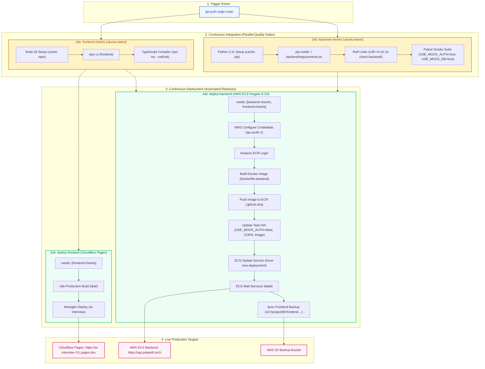
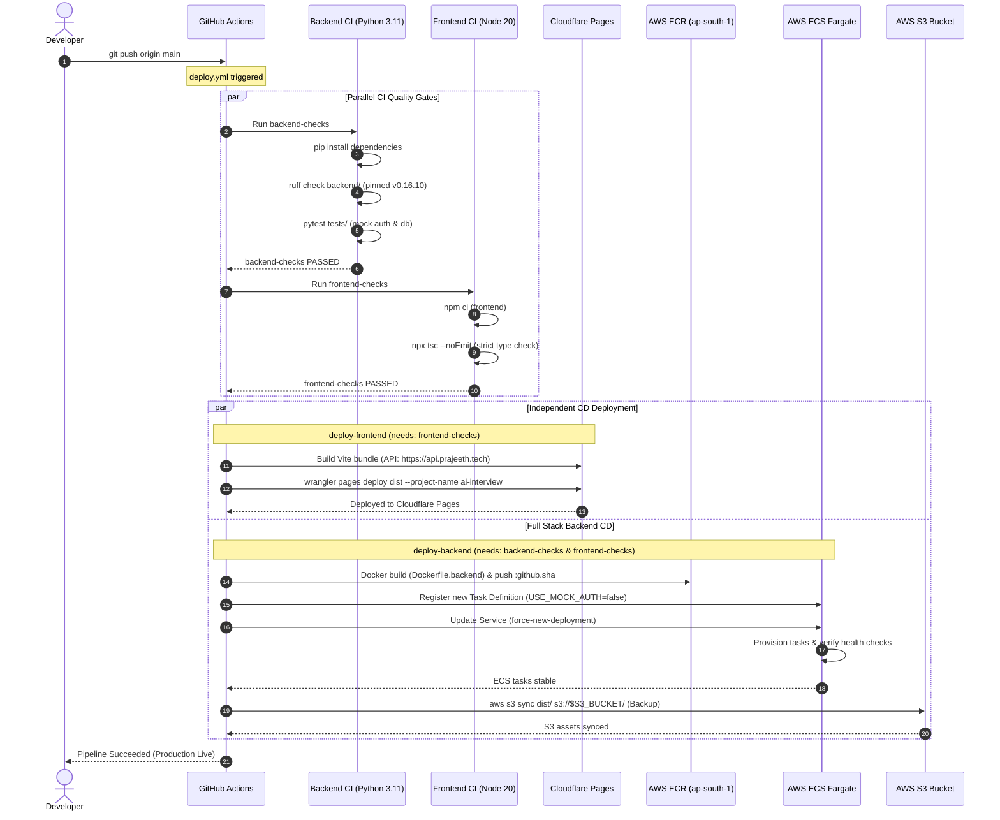

# CI/CD Pipeline Architecture

This document describes the automated Continuous Integration and Continuous Deployment (CI/CD) pipeline for the **AI Interview Platform** configured in [`.github/workflows/deploy.yml`](file:///.github/workflows/deploy.yml).

---

## 1. Pipeline Overview & Flowchart

---

## 2. End-to-End Sequence Diagram

---

## 3. Pipeline Stages & Specifications

### Stage 1: `backend-checks` (CI)
- **Runner**: `ubuntu-latest`
- **Runtime**: Python `3.11` (pip cache enabled)
- **Quality Checks**:
  1. **Dependencies**: `pip install -r backend/requirements.txt`
  2. **Static Analysis & Linting**: `ruff check backend/` using pinned `ruff==0.16.10`. Blocks deployment on undefined symbols, missing imports, or syntax violations.
  3. **Unit & Smoke Tests**: `pytest tests/ -x -q` run with `USE_MOCK_AUTH=true` and `USE_MOCK_DB=true`. Non-zero exit codes immediately abort the pipeline.

### Stage 2: `frontend-checks` (CI)
- **Runner**: `ubuntu-latest`
- **Runtime**: Node.js `20` (npm cache enabled via `package-lock.json`)
- **Quality Checks**:
  1. **Dependencies**: `npm ci` in `frontend/`
  2. **Type Safety**: `npx tsc --noEmit`. Compiles all TypeScript (`.ts`, `.tsx`) files in strict mode with no file output to guarantee zero runtime missing-prop or type errors.

### Stage 3: `deploy-frontend` (CD)
- **Prerequisite**: Depends on `frontend-checks`. Runs independently of backend deployments so frontend assets can deploy immediately once validated.
- **Environment**:
  - `VITE_API_BASE_URL`: `https://api.prajeeth.tech`
  - `VITE_API_WS_URL`: `wss://api.prajeeth.tech`
  - `CLOUDFLARE_API_TOKEN`: GitHub Secret
- **Deployment**:
  - `npm run build` (Vite)
  - `npx wrangler pages deploy dist --project-name ai-interview`
  - **Live URL**: `https://ai-interview-7r1.pages.dev`

### Stage 4: `deploy-backend` (CD)
- **Prerequisite**: Depends on both `backend-checks` and `frontend-checks`. Production infrastructure is never touched if any CI check fails.
- **Target Infrastructure**:
  - **AWS Region**: `ap-south-1` (Mumbai)
  - **ECR Registry**: `975903044204.dkr.ecr.ap-south-1.amazonaws.com`
  - **ECR Repository**: `project08-backend`
  - **ECS Cluster**: `project08`
  - **ECS Service**: `backend` (Fargate)
  - **ECS Task Family**: `project08-backend`
  - **S3 Bucket (Backup)**: `project08-frontend-975903044204`
- **Execution Flow**:
  1. Authenticates with AWS using IAM credentials via `aws-actions/configure-aws-credentials@v4`.
  2. Logs into Amazon ECR via `aws-actions/amazon-ecr-login@v2`.
  3. Builds Docker container using [`Dockerfile.backend`](file:///Dockerfile.backend) tagged with `git commit SHA` and pushes to ECR.
  4. Fetches active task definition via AWS CLI, injects the new container image, updates production CORS origins, sets `USE_MOCK_AUTH="false"` (enabling real AWS Cognito authentication), and registers the new revision.
  5. Triggers zero-downtime rolling deployment with `aws ecs update-service --force-new-deployment`.
  6. Waits for cluster stabilization with `aws ecs wait services-stable`.
  7. Syncs frontend distribution build to S3 as an immutable static backup.

---

## 4. Environment & Secrets Mapping

| Secret / Config | Destination | Purpose |
|---|---|---|
| `CLOUDFLARE_API_TOKEN` | Cloudflare Pages | Authentication for Wrangler deployment |
| `AWS_ACCESS_KEY_ID` | AWS IAM | Permission to build ECR, update ECS, and sync S3 |
| `AWS_SECRET_ACCESS_KEY` | AWS IAM | Secret credential for AWS CLI actions |
| `AWS_REGION` | GitHub Actions env | Target AWS region (`ap-south-1`) |
| `USE_MOCK_AUTH="false"` | ECS Task Definition | Enforces real Cognito RS256 token verification in production |
| `CORS_ALLOWED_ORIGINS` | ECS Task Definition | Whitelists Cloudflare Pages, custom domain, and load balancer |
