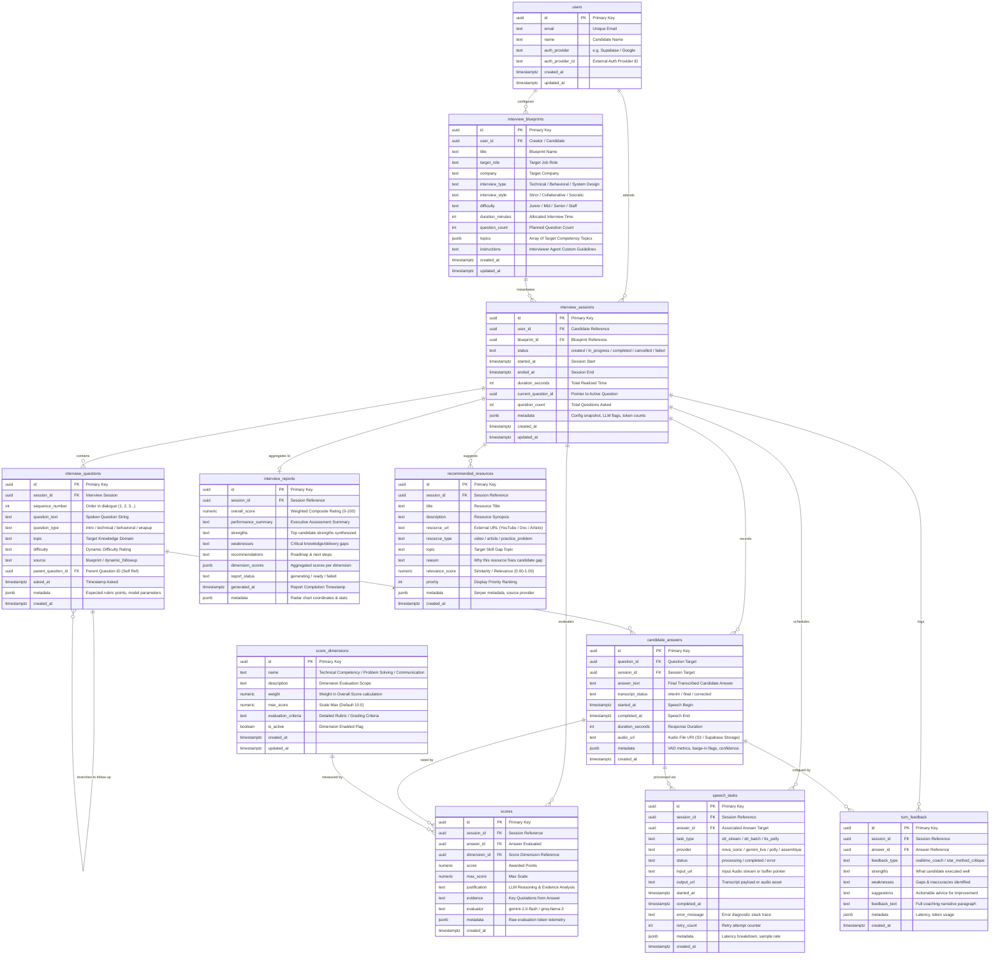
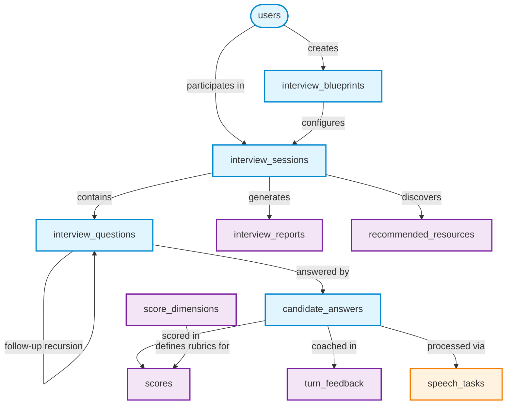

# Database Schema & Entity Relationship Diagram (ERD)

> **Live Interactive Link:** [Open in Mermaid Live Editor](https://mermaid.live/edit#pako:xVlrj9u2Ev0rhD8UG2Bfab71m7veBNskt6m9ucUFFhAoiZbZlUiVpOxVk_z3niH1sC3Z3uQ26CJA9OBQw5nDM2foT5NEp2LyE5sIM5M8M7x4UAx_lRXGss-fLy70JyaVE2YtxSaK80qUBveW_cQeYKyWMquMsA-To3ZWWCu1ClbcOaHSzmR09uMzSGUdV05yF768P1E3eDDNn5WwrpsH_juOyYau7M-QcJXKFN-LuLIbWiPZG5Fokz7D3JZCJKvIcfsYLG2yEmmVi5O2n7feGFFq04SeZ5kRGQWAOX3aAfK0KBB2kWIaqyuTiMaTKssQk-csAottjMSa51Ub_eNWrjIqWgqRxjx59Ma5zkaz1ufmaNDDtUhZXA-_PpjjUOpjwxVyQNFjS53nenNRlb1Xw08Pg2DwetuLgzbDECRGOgmHnmU-AE9pNLJnYb2WvPfZuxalEmk-lLdCcFv1sdves5_CjX9QyZTh34e3MPlgZMFNzd6KzlP6c-LJMVFwmWPMR0WLYbd0OxikeCEw5qZdHvsPHgxG8cqtIixsLVNhCGGX2SVbVCWPuRXsir3ROstPmEXw-WFy-4SMK56zKd6xD-2Ud7MdY0QJHFKU7i-WGEGZjLgbf1-V6c77L0PobjHXV8bRj6EMkPOvaeANuaMN1tyFbLBsJ11OQf25_e54UB03mXCR0X7wvb9jv-iYzfVILMEQJVd1P_ImPBgM7Nft6tLPDHwqmSDmV-xnseJrqY2_WdTWiYLNhJWZOjKPdbV3ceGMTBwtHVuSx5jFyTWlf6ETuk4Gc6RyuZRJlTvy-5dKSR-59wgmjERzu3B8udw2pYilFc2oVVRIVRGPPkym4IHE7-q71jV2L3cDS6YtlUSJrnCL5OZcKZj91ryA_3ixbfaH1SoG2ZQy8V8yhtdML9lWqAXKYlKzez9mJFjWmSoJDPYw6RwEtKeZgBc3lXW6YG8AKJFLJex3xHtH8v8_2jtamIslaF0lYmDQ7a7Oqsf9qJUPGJbjKuvJ1q8XOJCKuAKF01rcEd5zEd6AfBOR5_56CRYT6aHo4X8TokN4DXEggBl3yCJU3Z3xtyo9CEeLUg15RNtKO-yiueC5_Aue7SPRxyapDJbvuuoWOPCD9rmi4jZN_BZqkXkSyuGjv3XFcmofd4MRkFwIx5E2Tin0KpBZxUu70u6cvXv3ni1zntlzOPAoFPNzf0889rX9WwDZoLlDV7_5m3ztB80KfBCAiVRVxL5c_WqoxkgFPuLQNyiGZy_P2Y_n7NXl5eWLATa7qPs74KL0cerog3hQZUfMAu_CF6OBWLfFv_E2_24ML4Os2a0LRDE9z79VegPEZ4LNNEq4Ok6ysxoVHeaz_uEcyB1xN8hMElvddr1iaTCPgujadc5no-QDQPusfPDP-xjdzdjZQuRLooAXh7DFCb1h7923j58B6dunUiTEDKaKUZFYSfsJcC7QLeXkIaotMPJsSH85rCu_BbCD2HRBCRk9ifCWh4bDg6ryvrXgfC1JTd1DMFvo1hhR6Ul76kcOAdYMLl3U0bDfrbIggvUTEgGDuyjMz-NaL4OhL7I9hG7HvaX0HZPnse1c2BIMgk3QvBsRm6nUUWVI8k7pmr1GpWAf53dA4ivSGa1eXUDA8Uy8OAqy_05ndAt8AVkxZeICBNIQp2-t00Fhew7GBn3At0j7RrX3ym5LoVyRqo5zCLuFztfY-V6wFUVFI0cjl4qABsIcGKR1jd2GPtJTXqLLnbWCWwXtvY2Q2Yqy-Xu4QIx-XQvwW042RmBP5aChwYdb-4I_RT4kBAiMFew9f2JnM7HkIC_28vryekjQonMsol4NE1HGZkgeaQM2D7SAtsTwlAJw0wzanijWUNlcMWkjHorwztIVj2mq18j3P14Zm5bvnyiGLVUclmcNW7QGgRLa1O5ubj--Q2b_DZ-ePjaj32rz2eZyuuEouliR5-ZTmaec--wPUv0HdLNcNsjFSFIv0FzYrZTYH7CQsA_BdTyvrbQjYGlGPEwQUVQoSKigRpYGivwARzYQ0yQfMoEmRF78eHl9gf1vV0BWZvSfF2iCCn7x6iiNzPlmC66N4nIC2xPcUn81e-weVvybCDos7Vv3Wh2EteS0OIhYnlDwqHBEWP9Kp1F71jLSIGD2zK2I_H9foWB0xZmJJ5FUVP83aAoGhhvBHxUdwJDlG6heoAQlLYEW54nEU4IDYWqvsvmPhuO2poub-n6OiIDxdC0BoSXwIAs60UD-lDuy9KY4V-BBv2xCq-KmaZlJo2RQf6uj2HnHPaO3Or2yKFpfjZjhAeV3R027w3UoBN0uDyWCFAqqlbaS2kqvTdnZ9cXL6xGiL4VByAtq_yJbFd490n-Uf4rjlNJsKRWo7v71URyhed-CUf_G1sqthKU-7jicqJD4evvYivIrauexzpplgNrAujvZ5S2o5pqnBS8BShXcE7tmAQU9CzfFAmhsz5TTtoAgOv3AkU9TunuFlwklTAj3FV7ytD7ZTTcmrWCb-xl99iDjvEJtB5_gwJQblqwgF7EZtEFN9kfjP_hTgG71HWTHj8O_O2x3zu7mzXexRDdSlnYlUzd4UStdjhWhdhmNPu1OQT_O37Gz_-nqvorpIG2mSbZMDUCWixeHZ2mYlSobdZg8GOCqNCRmMKIMGvBUc7l4lGAosGQ42Br5IpVaT8E1cytpOx_QJzwhK_12Av7HSMCg1q3DBm5lnixkzrGTCIDz9jU44PIaNHC5xwPUD6A71X48STRb5ryGxm0ezbl63GtvBwBcCEN7pX1y3va-7dH014v47UP_f6cKW6sT6dmgKcgHukXyscWLdcQHWFThq7CLYu58RXbORiVa_iF9bh36K73mEQkvwmjQRFEeDoC9LQERPFnEec3l4QO_5veRwEPbp3zCGG1GTlbLyjXb5o6uWWjumnWgIMfVEkELpwAjSk5Xrp_hvmt9UYPrHFxMM_jW0TvvTje7p3vbfSlJ64LesVS_afPTPR1FZUpDayQ0N8QcuvJkcJZtSCV2p39zumP0Cy2-Gc7tdhd8SEKwGMF6TPVGAfucPGVm_5eLY7ifnLMJtnPBZUo_R3vEP0xQM-nMk366SkO_RhP6wbxyGmSY4KUzlcCT0A01P2M3j7_8DQ)  
> **Direct Base64 Fallback:** [Open Base64 Link](https://mermaid.live/edit#base64:eyJjb2RlIjogImVyRGlhZ3JhbVxuICAgIHVzZXJzIHx8LS1veyBpbnRlcnZpZXdfYmx1ZXByaW50cyA6IFwiY29uZmlndXJlc1wiXG4gICAgdXNlcnMgfHwtLW97IGludGVydmlld19zZXNzaW9ucyA6IFwiYXR0ZW5kc1wiXG4gICAgaW50ZXJ2aWV3X2JsdWVwcmludHMgfHwtLW97IGludGVydmlld19zZXNzaW9ucyA6IFwiaW5zdGFudGlhdGVzXCJcblxuICAgIGludGVydmlld19zZXNzaW9ucyB8fC0tb3sgaW50ZXJ2aWV3X3F1ZXN0aW9ucyA6IFwiY29udGFpbnNcIlxuICAgIGludGVydmlld19zZXNzaW9ucyB8fC0tb3sgY2FuZGlkYXRlX2Fuc3dlcnMgOiBcInJlY29yZHNcIlxuICAgIGludGVydmlld19zZXNzaW9ucyB8fC0tb3sgc3BlZWNoX3Rhc2tzIDogXCJzY2hlZHVsZXNcIlxuICAgIGludGVydmlld19zZXNzaW9ucyB8fC0tb3wgaW50ZXJ2aWV3X3JlcG9ydHMgOiBcImFnZ3JlZ2F0ZXMgdG9cIlxuICAgIGludGVydmlld19zZXNzaW9ucyB8fC0tb3sgcmVjb21tZW5kZWRfcmVzb3VyY2VzIDogXCJzdWdnZXN0c1wiXG4gICAgaW50ZXJ2aWV3X3Nlc3Npb25zIHx8LS1veyBzY29yZXMgOiBcImV2YWx1YXRlc1wiXG4gICAgaW50ZXJ2aWV3X3Nlc3Npb25zIHx8LS1veyB0dXJuX2ZlZWRiYWNrIDogXCJsb2dzXCJcblxuICAgIGludGVydmlld19xdWVzdGlvbnMgfHwtLW97IGNhbmRpZGF0ZV9hbnN3ZXJzIDogXCJhbnN3ZXJlZCBieVwiXG4gICAgaW50ZXJ2aWV3X3F1ZXN0aW9ucyB8fC0tb3sgaW50ZXJ2aWV3X3F1ZXN0aW9ucyA6IFwiYnJhbmNoZXMgdG8gZm9sbG93LXVwXCJcblxuICAgIGNhbmRpZGF0ZV9hbnN3ZXJzIHx8LS1veyBzY29yZXMgOiBcInJhdGVkIGJ5XCJcbiAgICBjYW5kaWRhdGVfYW5zd2VycyB8fC0tb3sgdHVybl9mZWVkYmFjayA6IFwiY3JpdGlxdWVkIGJ5XCJcbiAgICBjYW5kaWRhdGVfYW5zd2VycyB8fC0tb3sgc3BlZWNoX3Rhc2tzIDogXCJwcm9jZXNzZWQgdmlhXCJcblxuICAgIHNjb3JlX2RpbWVuc2lvbnMgfHwtLW97IHNjb3JlcyA6IFwibWVhc3VyZWQgYnlcIlxuXG4gICAgdXNlcnMge1xuICAgICAgICB1dWlkIGlkIFBLIFwiUHJpbWFyeSBLZXlcIlxuICAgICAgICB0ZXh0IGVtYWlsIFwiVW5pcXVlIEVtYWlsXCJcbiAgICAgICAgdGV4dCBuYW1lIFwiQ2FuZGlkYXRlIE5hbWVcIlxuICAgICAgICB0ZXh0IGF1dGhfcHJvdmlkZXIgXCJlLmcuIFN1cGFiYXNlIC8gR29vZ2xlXCJcbiAgICAgICAgdGV4dCBhdXRoX3Byb3ZpZGVyX2lkIFwiRXh0ZXJuYWwgQXV0aCBQcm92aWRlciBJRFwiXG4gICAgICAgIHRpbWVzdGFtcHR6IGNyZWF0ZWRfYXRcbiAgICAgICAgdGltZXN0YW1wdHogdXBkYXRlZF9hdFxuICAgIH1cblxuICAgIGludGVydmlld19ibHVlcHJpbnRzIHtcbiAgICAgICAgdXVpZCBpZCBQSyBcIlByaW1hcnkgS2V5XCJcbiAgICAgICAgdXVpZCB1c2VyX2lkIEZLIFwiQ3JlYXRvciAvIENhbmRpZGF0ZVwiXG4gICAgICAgIHRleHQgdGl0bGUgXCJCbHVlcHJpbnQgTmFtZVwiXG4gICAgICAgIHRleHQgdGFyZ2V0X3JvbGUgXCJUYXJnZXQgSm9iIFJvbGVcIlxuICAgICAgICB0ZXh0IGNvbXBhbnkgXCJUYXJnZXQgQ29tcGFueVwiXG4gICAgICAgIHRleHQgaW50ZXJ2aWV3X3R5cGUgXCJUZWNobmljYWwgLyBCZWhhdmlvcmFsIC8gU3lzdGVtIERlc2lnblwiXG4gICAgICAgIHRleHQgaW50ZXJ2aWV3X3N0eWxlIFwiU3RyaWN0IC8gQ29sbGFib3JhdGl2ZSAvIFNvY3JhdGljXCJcbiAgICAgICAgdGV4dCBkaWZmaWN1bHR5IFwiSnVuaW9yIC8gTWlkIC8gU2VuaW9yIC8gU3RhZmZcIlxuICAgICAgICBpbnQgZHVyYXRpb25fbWludXRlcyBcIkFsbG9jYXRlZCBJbnRlcnZpZXcgVGltZVwiXG4gICAgICAgIGludCBxdWVzdGlvbl9jb3VudCBcIlBsYW5uZWQgUXVlc3Rpb24gQ291bnRcIlxuICAgICAgICBqc29uYiB0b3BpY3MgXCJBcnJheSBvZiBUYXJnZXQgQ29tcGV0ZW5jeSBUb3BpY3NcIlxuICAgICAgICB0ZXh0IGluc3RydWN0aW9ucyBcIkludGVydmlld2VyIEFnZW50IEN1c3RvbSBHdWlkZWxpbmVzXCJcbiAgICAgICAgdGltZXN0YW1wdHogY3JlYXRlZF9hdFxuICAgICAgICB0aW1lc3RhbXB0eiB1cGRhdGVkX2F0XG4gICAgfVxuXG4gICAgaW50ZXJ2aWV3X3Nlc3Npb25zIHtcbiAgICAgICAgdXVpZCBpZCBQSyBcIlByaW1hcnkgS2V5XCJcbiAgICAgICAgdXVpZCB1c2VyX2lkIEZLIFwiQ2FuZGlkYXRlIFJlZmVyZW5jZVwiXG4gICAgICAgIHV1aWQgYmx1ZXByaW50X2lkIEZLIFwiQmx1ZXByaW50IFJlZmVyZW5jZVwiXG4gICAgICAgIHRleHQgc3RhdHVzIFwiY3JlYXRlZCAvIGluX3Byb2dyZXNzIC8gY29tcGxldGVkIC8gY2FuY2VsbGVkIC8gZmFpbGVkXCJcbiAgICAgICAgdGltZXN0YW1wdHogc3RhcnRlZF9hdCBcIlNlc3Npb24gU3RhcnRcIlxuICAgICAgICB0aW1lc3RhbXB0eiBlbmRlZF9hdCBcIlNlc3Npb24gRW5kXCJcbiAgICAgICAgaW50IGR1cmF0aW9uX3NlY29uZHMgXCJUb3RhbCBSZWFsaXplZCBUaW1lXCJcbiAgICAgICAgdXVpZCBjdXJyZW50X3F1ZXN0aW9uX2lkIFwiUG9pbnRlciB0byBBY3RpdmUgUXVlc3Rpb25cIlxuICAgICAgICBpbnQgcXVlc3Rpb25fY291bnQgXCJUb3RhbCBRdWVzdGlvbnMgQXNrZWRcIlxuICAgICAgICBqc29uYiBtZXRhZGF0YSBcIkNvbmZpZyBzbmFwc2hvdCwgTExNIGZsYWdzLCB0b2tlbiBjb3VudHNcIlxuICAgICAgICB0aW1lc3RhbXB0eiBjcmVhdGVkX2F0XG4gICAgICAgIHRpbWVzdGFtcHR6IHVwZGF0ZWRfYXRcbiAgICB9XG5cbiAgICBpbnRlcnZpZXdfcXVlc3Rpb25zIHtcbiAgICAgICAgdXVpZCBpZCBQSyBcIlByaW1hcnkgS2V5XCJcbiAgICAgICAgdXVpZCBzZXNzaW9uX2lkIEZLIFwiSW50ZXJ2aWV3IFNlc3Npb25cIlxuICAgICAgICBpbnQgc2VxdWVuY2VfbnVtYmVyIFwiT3JkZXIgaW4gZGlhbG9ndWUgKDEsIDIsIDMuLi4pXCJcbiAgICAgICAgdGV4dCBxdWVzdGlvbl90ZXh0IFwiU3Bva2VuIFF1ZXN0aW9uIFN0cmluZ1wiXG4gICAgICAgIHRleHQgcXVlc3Rpb25fdHlwZSBcImludHJvIC8gdGVjaG5pY2FsIC8gYmVoYXZpb3JhbCAvIHdyYXB1cFwiXG4gICAgICAgIHRleHQgdG9waWMgXCJUYXJnZXQgS25vd2xlZGdlIERvbWFpblwiXG4gICAgICAgIHRleHQgZGlmZmljdWx0eSBcIkR5bmFtaWMgRGlmZmljdWx0eSBSYXRpbmdcIlxuICAgICAgICB0ZXh0IHNvdXJjZSBcImJsdWVwcmludCAvIGR5bmFtaWNfZm9sbG93dXBcIlxuICAgICAgICB1dWlkIHBhcmVudF9xdWVzdGlvbl9pZCBGSyBcIlBhcmVudCBRdWVzdGlvbiBJRCAoU2VsZiBSZWYpXCJcbiAgICAgICAgdGltZXN0YW1wdHogYXNrZWRfYXQgXCJUaW1lc3RhbXAgQXNrZWRcIlxuICAgICAgICBqc29uYiBtZXRhZGF0YSBcIkV4cGVjdGVkIHJ1YnJpYyBwb2ludHMsIG1vZGVsIHBhcmFtZXRlcnNcIlxuICAgICAgICB0aW1lc3RhbXB0eiBjcmVhdGVkX2F0XG4gICAgfVxuXG4gICAgY2FuZGlkYXRlX2Fuc3dlcnMge1xuICAgICAgICB1dWlkIGlkIFBLIFwiUHJpbWFyeSBLZXlcIlxuICAgICAgICB1dWlkIHF1ZXN0aW9uX2lkIEZLIFwiUXVlc3Rpb24gVGFyZ2V0XCJcbiAgICAgICAgdXVpZCBzZXNzaW9uX2lkIEZLIFwiU2Vzc2lvbiBUYXJnZXRcIlxuICAgICAgICB0ZXh0IGFuc3dlcl90ZXh0IFwiRmluYWwgVHJhbnNjcmliZWQgQ2FuZGlkYXRlIEFuc3dlclwiXG4gICAgICAgIHRleHQgdHJhbnNjcmlwdF9zdGF0dXMgXCJpbnRlcmltIC8gZmluYWwgLyBjb3JyZWN0ZWRcIlxuICAgICAgICB0aW1lc3RhbXB0eiBzdGFydGVkX2F0IFwiU3BlZWNoIEJlZ2luXCJcbiAgICAgICAgdGltZXN0YW1wdHogY29tcGxldGVkX2F0IFwiU3BlZWNoIEVuZFwiXG4gICAgICAgIGludCBkdXJhdGlvbl9zZWNvbmRzIFwiUmVzcG9uc2UgRHVyYXRpb25cIlxuICAgICAgICB0ZXh0IGF1ZGlvX3VybCBcIkF1ZGlvIEZpbGUgVVJJIChTMyAvIFN1cGFiYXNlIFN0b3JhZ2UpXCJcbiAgICAgICAganNvbmIgbWV0YWRhdGEgXCJWQUQgbWV0cmljcywgYmFyZ2UtaW4gZmxhZ3MsIGNvbmZpZGVuY2VcIlxuICAgICAgICB0aW1lc3RhbXB0eiBjcmVhdGVkX2F0XG4gICAgfVxuXG4gICAgc2NvcmVfZGltZW5zaW9ucyB7XG4gICAgICAgIHV1aWQgaWQgUEsgXCJQcmltYXJ5IEtleVwiXG4gICAgICAgIHRleHQgbmFtZSBcIlRlY2huaWNhbCBDb21wZXRlbmN5IC8gUHJvYmxlbSBTb2x2aW5nIC8gQ29tbXVuaWNhdGlvblwiXG4gICAgICAgIHRleHQgZGVzY3JpcHRpb24gXCJEaW1lbnNpb24gRXZhbHVhdGlvbiBTY29wZVwiXG4gICAgICAgIG51bWVyaWMgd2VpZ2h0IFwiV2VpZ2h0IGluIE92ZXJhbGwgU2NvcmUgY2FsY3VsYXRpb25cIlxuICAgICAgICBudW1lcmljIG1heF9zY29yZSBcIlNjYWxlIE1heCAoRGVmYXVsdCAxMC4wKVwiXG4gICAgICAgIHRleHQgZXZhbHVhdGlvbl9jcml0ZXJpYSBcIkRldGFpbGVkIFJ1YnJpYyAvIEdyYWRpbmcgQ3JpdGVyaWFcIlxuICAgICAgICBib29sZWFuIGlzX2FjdGl2ZSBcIkRpbWVuc2lvbiBFbmFibGVkIEZsYWdcIlxuICAgICAgICB0aW1lc3RhbXB0eiBjcmVhdGVkX2F0XG4gICAgICAgIHRpbWVzdGFtcHR6IHVwZGF0ZWRfYXRcbiAgICB9XG5cbiAgICBzY29yZXMge1xuICAgICAgICB1dWlkIGlkIFBLIFwiUHJpbWFyeSBLZXlcIlxuICAgICAgICB1dWlkIHNlc3Npb25faWQgRksgXCJTZXNzaW9uIFJlZmVyZW5jZVwiXG4gICAgICAgIHV1aWQgYW5zd2VyX2lkIEZLIFwiQW5zd2VyIEV2YWx1YXRlZFwiXG4gICAgICAgIHV1aWQgZGltZW5zaW9uX2lkIEZLIFwiU2NvcmUgRGltZW5zaW9uIFJlZmVyZW5jZVwiXG4gICAgICAgIG51bWVyaWMgc2NvcmUgXCJBd2FyZGVkIFBvaW50c1wiXG4gICAgICAgIG51bWVyaWMgbWF4X3Njb3JlIFwiTWF4IFNjYWxlXCJcbiAgICAgICAgdGV4dCBqdXN0aWZpY2F0aW9uIFwiTExNIFJlYXNvbmluZyAmIEV2aWRlbmNlIEFuYWx5c2lzXCJcbiAgICAgICAgdGV4dCBldmlkZW5jZSBcIktleSBRdW90YXRpb25zIGZyb20gQW5zd2VyXCJcbiAgICAgICAgdGV4dCBldmFsdWF0b3IgXCJnZW1pbmktMi4wLWZsYXNoIC8gZ3JvcS1sbGFtYS0zXCJcbiAgICAgICAganNvbmIgbWV0YWRhdGEgXCJSYXcgZXZhbHVhdGlvbiB0b2tlbiB0ZWxlbWV0cnlcIlxuICAgICAgICB0aW1lc3RhbXB0eiBjcmVhdGVkX2F0XG4gICAgfVxuXG4gICAgdHVybl9mZWVkYmFjayB7XG4gICAgICAgIHV1aWQgaWQgUEsgXCJQcmltYXJ5IEtleVwiXG4gICAgICAgIHV1aWQgc2Vzc2lvbl9pZCBGSyBcIlNlc3Npb24gUmVmZXJlbmNlXCJcbiAgICAgICAgdXVpZCBhbnN3ZXJfaWQgRksgXCJBbnN3ZXIgUmVmZXJlbmNlXCJcbiAgICAgICAgdGV4dCBmZWVkYmFja190eXBlIFwicmVhbHRpbWVfY29hY2ggLyBzdGFyX21ldGhvZF9jcml0aXF1ZVwiXG4gICAgICAgIHRleHQgc3RyZW5ndGhzIFwiV2hhdCBjYW5kaWRhdGUgZXhlY3V0ZWQgd2VsbFwiXG4gICAgICAgIHRleHQgd2Vha25lc3NlcyBcIkdhcHMgJiBpbmFjY3VyYWNpZXMgaWRlbnRpZmllZFwiXG4gICAgICAgIHRleHQgc3VnZ2VzdGlvbnMgXCJBY3Rpb25hYmxlIGFkdmljZSBmb3IgaW1wcm92ZW1lbnRcIlxuICAgICAgICB0ZXh0IGZlZWRiYWNrX3RleHQgXCJGdWxsIGNvYWNoaW5nIG5hcnJhdGl2ZSBwYXJhZ3JhcGhcIlxuICAgICAgICBqc29uYiBtZXRhZGF0YSBcIkxhdGVuY3ksIHRva2VuIHVzYWdlXCJcbiAgICAgICAgdGltZXN0YW1wdHogY3JlYXRlZF9hdFxuICAgIH1cblxuICAgIGludGVydmlld19yZXBvcnRzIHtcbiAgICAgICAgdXVpZCBpZCBQSyBcIlByaW1hcnkgS2V5XCJcbiAgICAgICAgdXVpZCBzZXNzaW9uX2lkIEZLIFwiU2Vzc2lvbiBSZWZlcmVuY2VcIlxuICAgICAgICBudW1lcmljIG92ZXJhbGxfc2NvcmUgXCJXZWlnaHRlZCBDb21wb3NpdGUgUmF0aW5nICgwLTEwMClcIlxuICAgICAgICB0ZXh0IHBlcmZvcm1hbmNlX3N1bW1hcnkgXCJFeGVjdXRpdmUgQXNzZXNzbWVudCBTdW1tYXJ5XCJcbiAgICAgICAgdGV4dCBzdHJlbmd0aHMgXCJUb3AgY2FuZGlkYXRlIHN0cmVuZ3RocyBzeW50aGVzaXplZFwiXG4gICAgICAgIHRleHQgd2Vha25lc3NlcyBcIkNyaXRpY2FsIGtub3dsZWRnZS9kZWxpdmVyeSBnYXBzXCJcbiAgICAgICAgdGV4dCByZWNvbW1lbmRhdGlvbnMgXCJSb2FkbWFwICYgbmV4dCBzdGVwc1wiXG4gICAgICAgIGpzb25iIGRpbWVuc2lvbl9zY29yZXMgXCJBZ2dyZWdhdGVkIHNjb3JlcyBwZXIgZGltZW5zaW9uXCJcbiAgICAgICAgdGV4dCByZXBvcnRfc3RhdHVzIFwiZ2VuZXJhdGluZyAvIHJlYWR5IC8gZmFpbGVkXCJcbiAgICAgICAgdGltZXN0YW1wdHogZ2VuZXJhdGVkX2F0IFwiUmVwb3J0IENvbXBsZXRpb24gVGltZXN0YW1wXCJcbiAgICAgICAganNvbmIgbWV0YWRhdGEgXCJSYWRhciBjaGFydCBjb29yZGluYXRlcyAmIHN0YXRzXCJcbiAgICB9XG5cbiAgICByZWNvbW1lbmRlZF9yZXNvdXJjZXMge1xuICAgICAgICB1dWlkIGlkIFBLIFwiUHJpbWFyeSBLZXlcIlxuICAgICAgICB1dWlkIHNlc3Npb25faWQgRksgXCJTZXNzaW9uIFJlZmVyZW5jZVwiXG4gICAgICAgIHRleHQgdGl0bGUgXCJSZXNvdXJjZSBUaXRsZVwiXG4gICAgICAgIHRleHQgZGVzY3JpcHRpb24gXCJSZXNvdXJjZSBTeW5vcHNpc1wiXG4gICAgICAgIHRleHQgcmVzb3VyY2VfdXJsIFwiRXh0ZXJuYWwgVVJMIChZb3VUdWJlIC8gRG9jIC8gQXJ0aWNsZSlcIlxuICAgICAgICB0ZXh0IHJlc291cmNlX3R5cGUgXCJ2aWRlbyAvIGFydGljbGUgLyBwcmFjdGljZV9wcm9ibGVtXCJcbiAgICAgICAgdGV4dCB0b3BpYyBcIlRhcmdldCBTa2lsbCBHYXAgVG9waWNcIlxuICAgICAgICB0ZXh0IHJlYXNvbiBcIldoeSB0aGlzIHJlc291cmNlIGZpeGVzIGNhbmRpZGF0ZSBnYXBcIlxuICAgICAgICBudW1lcmljIHJlbGV2YW5jZV9zY29yZSBcIlNpbWlsYXJpdHkgLyBSZWxldmFuY2UgKDAuMDAtMS4wMClcIlxuICAgICAgICBpbnQgcHJpb3JpdHkgXCJEaXNwbGF5IFByaW9yaXR5IFJhbmtpbmdcIlxuICAgICAgICBqc29uYiBtZXRhZGF0YSBcIlNlcnBlciBtZXRhZGF0YSwgc291cmNlIHByb3ZpZGVyXCJcbiAgICAgICAgdGltZXN0YW1wdHogY3JlYXRlZF9hdFxuICAgIH1cblxuICAgIHNwZWVjaF90YXNrcyB7XG4gICAgICAgIHV1aWQgaWQgUEsgXCJQcmltYXJ5IEtleVwiXG4gICAgICAgIHV1aWQgc2Vzc2lvbl9pZCBGSyBcIlNlc3Npb24gUmVmZXJlbmNlXCJcbiAgICAgICAgdXVpZCBhbnN3ZXJfaWQgRksgXCJBc3NvY2lhdGVkIEFuc3dlciBUYXJnZXRcIlxuICAgICAgICB0ZXh0IHRhc2tfdHlwZSBcInN0dF9zdHJlYW0gLyBzdHRfYmF0Y2ggLyB0dHNfcG9sbHlcIlxuICAgICAgICB0ZXh0IHByb3ZpZGVyIFwibm92YV9zb25pYyAvIGdlbWluaV9saXZlIC8gcG9sbHkgLyBhc3NlbWJseWFpXCJcbiAgICAgICAgdGV4dCBzdGF0dXMgXCJwcm9jZXNzaW5nIC8gY29tcGxldGVkIC8gZXJyb3JcIlxuICAgICAgICB0ZXh0IGlucHV0X3VybCBcIklucHV0IEF1ZGlvIHN0cmVhbSBvciBidWZmZXIgcG9pbnRlclwiXG4gICAgICAgIHRleHQgb3V0cHV0X3VybCBcIlRyYW5zY3JpcHQgcGF5bG9hZCBvciBhdWRpbyBhc3NldFwiXG4gICAgICAgIHRpbWVzdGFtcHR6IHN0YXJ0ZWRfYXRcbiAgICAgICAgdGltZXN0YW1wdHogY29tcGxldGVkX2F0XG4gICAgICAgIHRleHQgZXJyb3JfbWVzc2FnZSBcIkVycm9yIGRpYWdub3N0aWMgc3RhY2sgdHJhY2VcIlxuICAgICAgICBpbnQgcmV0cnlfY291bnQgXCJSZXRyeSBhdHRlbXB0IGNvdW50ZXJcIlxuICAgICAgICBqc29uYiBtZXRhZGF0YSBcIkxhdGVuY3kgYnJlYWtkb3duLCBzYW1wbGUgcmF0ZVwiXG4gICAgICAgIHRpbWVzdGFtcHR6IGNyZWF0ZWRfYXRcbiAgICB9IiwgIm1lcm1haWQiOiAie1xuICBcInRoZW1lXCI6IFwiZGVmYXVsdFwiXG59IiwgImF1dG9TeW5jIjogdHJ1ZSwgInVwZGF0ZURpYWdyYW0iOiB0cnVlfQ==)

---

## 📊 Entity Relationship Diagram (ERD)

---

## 🏛️ High-Level Architectural Flow

---

## 📋 Table Roles & Data Classification

| Table Name | Layer / Role | Description |
| :--- | :--- | :--- |
| `users` | **Identity** | Candidate & user account profiles |
| `interview_blueprints` | **Planning** | Interview blueprint template & competency definitions |
| `interview_sessions` | **Runtime Lifecycle** | Live session runtime state, active question pointer & timing |
| `interview_questions` | **Dialogue Content** | Spoken prompts & dynamic follow-up tree |
| `candidate_answers` | **Evidence** | Spoken responses, audio URLs & transcript status |
| `score_dimensions` | **Rubric Config** | Grading dimensions, weightings & criteria |
| `scores` | **Evaluation Result** | Numerical ratings, LLM justifications & evidence quotes |
| `turn_feedback` | **Per-Turn Coaching** | Instant tips, strengths, weaknesses & STAR critique |
| `interview_reports` | **Aggregation** | Final candidate scorecard, radar summary & executive analysis |
| `recommended_resources` | **Post-Interview Action** | Curated roadmaps, tutorials & videos from Serper |
| `speech_tasks` | **Speech Processing** | Async audio processing & transcription telemetry |
