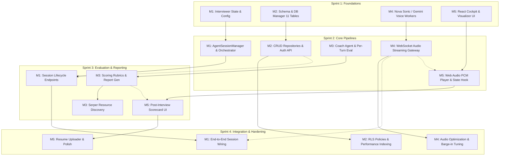

# Integrated Voice Interview Platform — 5-Member Team Work Allocation

> **Target Tracking:** Mentor Review & Sprint Tracking Sheet  
> **Architecture Source:** `CONTEXT.md` & `backend/database/schema.sql`  
> **Team Size:** 5 Members (Dedicated Feature Ownership)

---

## 👥 High-Level Role Distribution

| Member | Assigned Role | Primary Focus Area | Key Technical Scope |
| :--- | :--- | :--- | :--- |
| **Member 1 (You)** | **Interview Agent & Orchestration Lead** | Interview State Machine & Session Controller | `InterviewerAgent` (Zero-LLM Controller), `AgentSessionManager`, Prompt Injection, Turn-Taking, Session Lifecycle API |
| **Member 2** | **Database & Data Platform Engineer** | Full Supabase Database, Schema & Persistence | 11 PostgreSQL Tables, Row-Level Security (RLS), Triggers, Migrations, CRUD Repositories, Data Integrity |
| **Member 3** | **Evaluation & AI Coaching Agent Engineer** | Post-Turn & Post-Interview Evaluation Engine | `AgenticCoachAgent` (Gemini/Groq), Multi-Dimensional Scoring Rubrics, Report Generation, Serper Resource Discovery |
| **Member 4** | **Voice & Real-Time Streaming Engineer** | Realtime Voice Pipelines & WebSocket Gateway | Amazon Nova 2 Sonic Bedrock HTTP/2 Worker, Gemini 3.8 Live Voice, WebSockets, Audio Buffer Management & Barge-in |
| **Member 5** | **Frontend UI & Interview Cockpit Engineer** | React SPA, WebGL Cockpit & Candidate Portal | React/Vite/TypeScript, WebGL Audio Visualizer, Web Audio PCM Player, Post-Interview Scorecard, Session Setup UI |

---

## 📊 Mentor Tracking Sheet Format (Copy-Paste Ready Table)

*Copy the table below directly into Grist / Google Sheets / Excel:*

| Task ID | Member | Module / Feature | Task Description & Deliverables | Files / Deliverables Owned | Dependencies | Est. Days | Status |
| :--- | :--- | :--- | :--- | :--- | :--- | :--- | :--- |
| **M1-01** | Member 1 (You) | Interview Agent | Build zero-LLM `InterviewerAgent` state controller, phase management (Intro -> Tech -> Behavioral -> Wrapup), topic coverage tracking | `backend/agents/interviewer.py`, `interview_state.py`, `constants.py` | None | 3 Days | In Progress |
| **M1-02** | Member 1 (You) | Context Injection | Implement dynamic system prompt assembly injecting Job Role, JD, Resume content, Style, and Difficulty | `backend/agents/templates/interviewer_templates.py`, `config_models.py` | None | 2 Days | In Progress |
| **M1-03** | Member 1 (You) | Session Orchestrator | Build `AgentSessionManager` to coordinate voice turns, conversation history logging, and timer limits | `backend/agents/orchestrator.py`, `utils/time_manager.py` | None | 3 Days | In Progress |
| **M1-04** | Member 1 (You) | Interview Session API | Implement REST API endpoints for session initialization, turn recording, config updates, and status checks | `backend/api/agent_api.py`, `middleware/session_middleware.py` | M2-03 | 2 Days | Pending |
| **M1-05** | Member 1 (You) | Agent Integration | Wire Interviewer lifecycle with Voice Gateway & Coach triggers upon turn finalization | `backend/services/session_manager.py`, `utils/event_bus.py` | M3-02, M4-03 | 3 Days | Pending |
| **M2-01** | Member 2 | Database Core Schema | Design and implement PostgreSQL schema for core session and candidate tables (`users`, `interview_blueprints`, `interview_sessions`, `interview_questions`, `candidate_answers`) | `backend/database/schema.sql`, `migrations/001_core.sql` | None | 3 Days | In Progress |
| **M2-02** | Member 2 | Evaluation & Analytics Schema | Design and implement tables for scoring, feedback, and speech tasks (`score_dimensions`, `scores`, `turn_feedback`, `interview_reports`, `recommended_resources`, `speech_tasks`) | `backend/database/schema.sql`, `migrations/002_analytics.sql` | M2-01 | 2 Days | In Progress |
| **M2-03** | Member 2 | Supabase Client & CRUD | Build `DatabaseManager` and `MockDatabaseManager` for CRUD operations across all 11 tables | `backend/database/db_manager.py`, `mock_db_manager.py` | M2-01, M2-02 | 3 Days | In Progress |
| **M2-04** | Member 2 | Security & Isolation | Implement Row-Level Security (RLS) policies, UUID generation, index optimization, and updated_at triggers | `backend/database/schema.sql` (RLS & Triggers) | M2-02 | 2 Days | Pending |
| **M2-05** | Member 2 | Auth & User Endpoints | Build user authentication endpoints and JWT verification middleware | `backend/api/auth_api.py`, `backend/database/auth_helpers.py` | M2-03 | 2 Days | Pending |
| **M3-01** | Member 3 | Evaluation LLM Service | Configure LLM integration layer for Gemini (`ChatGoogleGenerativeAI`) & Groq fallback | `backend/services/llm_service.py`, `utils/llm_utils.py` | None | 2 Days | Pending |
| **M3-02** | Member 3 | Per-Turn Coaching Agent | Build `AgenticCoachAgent.evaluate_answer()` for real-time turn feedback and STAR methodology critique | `backend/agents/agentic_coach.py`, `templates/coach_templates.py` | M3-01 | 3 Days | Pending |
| **M3-03** | Member 3 | Comprehensive Scoring Engine | Implement multi-dimensional evaluation rubric (Technical, Communication, Problem Solving, Leadership) | `backend/agents/evaluation_rubrics.py`, `score_dimensions` logic | M3-02, M2-02 | 3 Days | Pending |
| **M3-04** | Member 3 | Final Report Synthesis | Build end-of-interview report generator compiling scorecard, summary, strengths, and areas of improvement | `backend/agents/report_generator.py`, `api/agent_api.py` (report endpoints) | M3-03, M2-03 | 2 Days | Pending |
| **M3-05** | Member 3 | Learning Resource Discovery | Integrate Serper.dev API & build `LearningResourceSearchTool` to find targeted tutorials based on candidate weaknesses | `backend/services/search_service.py`, `search_helpers.py`, `tools/search_tool.py` | M3-04 | 2 Days | Pending |
| **M4-01** | Member 4 | Nova Bedrock Worker | Build Amazon Nova 2 Sonic Bedrock HTTP/2 bidirectional streaming worker process (py -3.13) | `backend/services/nova_sonic_worker.py`, `config/__init__.py` | None | 4 Days | In Progress |
| **M4-02** | Member 4 | Voice Engine Orchestration | Implement `NovaSonicVoiceEngine` & `NovaSonicSession` process supervisor with 7.5m stream auto-renewal | `backend/services/nova_sonic_engine.py` | M4-01 | 3 Days | In Progress |
| **M4-03** | Member 4 | WebSocket Voice Gateway | Build real-time WebSocket endpoint `/api/speech-to-text/stream` with connection tracking and audio streaming | `backend/api/speech_api.py`, `speech/websocket_processor.py`, `connection_manager.py` | M4-02 | 3 Days | In Progress |
| **M4-04** | Member 4 | Gemini Live Voice Fallback | Implement fallback real-time voice engine using Gemini 3.8 Live API (`gemini_voice_engine.py`) | `backend/services/gemini_voice_engine.py` | M4-03 | 2 Days | Pending |
| **M4-05** | Member 4 | Audio Optimization & Barge-in | Implement audio chunking (16kHz PCM in / 24kHz PCM out), barge-in handling, and echo cancellation coordination | `backend/api/speech/audio_utils.py`, `tts_service.py` | M4-03 | 2 Days | Pending |
| **M5-01** | Member 5 | Interview Cockpit UI | Build active interview cockpit screen (`InterviewSession.tsx`, `CockpitChatStream.tsx`) with Theme 03 Red & Gold design | `frontend/src/components/InterviewSession.tsx`, `CockpitChatStream.tsx` | None | 3 Days | In Progress |
| **M5-02** | Member 5 | WebGL Audio Visualizer | Implement WebGL GLSL real-time oscilloscope wave rendering mic audio and AI speech waves | `frontend/src/components/CockpitAudioWave.tsx` | M5-01 | 2 Days | In Progress |
| **M5-03** | Member 5 | Web Audio Streaming Player | Build gapless PCM audio player with `AudioContext` and mic transmission gating to avoid echo loops | `frontend/src/utils/streamingAudioPlayer.ts`, `hooks/useVoiceFirstInterview.ts` | M5-02, M4-03 | 3 Days | In Progress |
| **M5-04** | Member 5 | Post-Interview Scorecard UI | Build rich post-interview analysis dashboard with radar charts, feedback breakdown, and resource links | `frontend/src/components/PostInterviewReport.tsx`, `TranscriptDrawer.tsx` | M3-04, M5-01 | 3 Days | Pending |
| **M5-05** | Member 5 | Config & Resume Upload Portal | Build candidate setup onboarding form, PDF/DOCX resume file upload, and auth modal dialogs | `frontend/src/pages/Index.tsx`, `components/AuthModal.tsx`, `services/api.ts` | M1-04, M2-05 | 2 Days | Pending |

---

## 🔍 Detailed Breakdown & Justification by Member

### 👤 Member 1: Interview Agent & Orchestration Lead (Your Work)
* **Rationale:** Owns the real-time dialogue state machine, ensures the interview follows a structured progression, injects candidate context into the prompt, and maintains session state.
* **Core Responsibilities:**
  1. **Zero-LLM Interview State Controller (`InterviewerAgent`):** Tracks phases (Introduction -> Technical -> Behavioral -> Wrap-up), monitors topic coverage, question counts, and triggers interview completion on timer expiration.
  2. **Context Engine:** Extracts job requirements and candidate resume skills to dynamically build the structured system prompt for the voice model.
  3. **Session Orchestrator (`AgentSessionManager`):** Central coordinator maintaining the conversational thread, dispatching turns to the evaluation agent, and synchronizing state.
  4. **Interview REST Lifecycle API:** Manages `/interview/session`, `/interview/start`, `/interview/message`, and `/interview/end`.

---

### 👤 Member 2: Database & Data Platform Engineer
* **Rationale:** Owns the complete persistence layer across all 11 relational tables in Supabase PostgreSQL, ensuring data integrity, security, and low-latency querying.
* **11 Database Tables Owned:**
  1. `users`: Candidate profiles, credentials, and metadata.
  2. `interview_blueprints`: Interview templates, target competencies, and difficulty configurations.
  3. `interview_sessions`: Session states, active phases, configuration payloads, and timestamps.
  4. `interview_questions`: Questions asked dynamically during the session.
  5. `candidate_answers`: Transcribed candidate responses mapped to questions.
  6. `score_dimensions`: Assessment criteria (e.g., Problem Solving, System Design, Communication).
  7. `scores`: Numerical ratings and evaluations across each score dimension.
  8. `turn_feedback`: Granular per-turn hints, coaching critiques, and improvement points.
  9. `interview_reports`: Final synthesized candidate scorecard, summary, and qualitative breakdown.
  10. `recommended_resources`: Targeted learning links, articles, and tutorials tailored to candidate gaps.
  11. `speech_tasks`: Asynchronous speech jobs (STT batch, audio cache records, TTS processing).
* **Key Tasks:** DB Schema creation, Row Level Security (RLS) policies, CRUD repositories (`db_manager.py`, `mock_db_manager.py`), and Auth API endpoints (`auth_api.py`).

---

### 👤 Member 3: Evaluation & AI Coaching Agent Engineer
* **Rationale:** Owns the intelligence behind candidate grading, feedback generation, multi-dimensional scoring rubrics, and post-interview learning path recommendation.
* **Core Responsibilities:**
  1. **`AgenticCoachAgent`:** Multi-turn evaluation using Gemini 2.0 / Groq LLMs.
  2. **Per-Turn Answer Evaluation (`evaluate_answer`):** Provides real-time coaching tips, evaluates answer depth against question intent, and checks STAR format adherence.
  3. **Multi-Dimensional Scoring Rubrics:** Calculates scores across technical accuracy, structure, clarity, and behavioral alignment.
  4. **Post-Interview Report Generator:** Synthesizes final candidate performance summary, strengths, weaknesses, and actionable feedback.
  5. **Resource Recommendation Pipeline:** Leverages Serper.dev web search tool (`LearningResourceSearchTool`) to automatically fetch tailored YouTube tutorials, documentation, and practice problems for weak topics.

---

### 👤 Member 4: Voice & Real-Time Streaming Engineer
* **Rationale:** Owns the low-latency bidirectional voice pipeline, audio transport, and real-time audio conversion between client and cloud models.
* **Core Responsibilities:**
  1. **Amazon Nova 2 Sonic Engine (`nova_sonic_worker.py` & `nova_sonic_engine.py`):** Bedrock bidirectional HTTP/2 streaming worker subprocess (Python 3.13), handling raw audio in/out and turn detection.
  2. **Stream Renewal Supervisor:** Manages graceful 7.5-minute Bedrock stream renewal with rolling conversation context injection.
  3. **WebSocket Voice Gateway (`speech_api.py`, `websocket_processor.py`):** Binary/JSON WebSocket streaming server at `/api/speech-to-text/stream`.
  4. **Gemini Live Voice Engine (`gemini_voice_engine.py`):** Real-time speech-to-speech fallback engine using Gemini 3.8 Live API.
  5. **Audio Pipeline & Barge-In:** 16kHz PCM uplink, 24kHz PCM downlink, interruption detection (barge-in), and acoustic echo loop prevention.

---

### 👤 Member 5: Frontend UI & Interview Cockpit Engineer
* **Rationale:** Owns the candidate-facing application, real-time audio visualization, audio hardware I/O management, and interactive reporting cockpit.
* **Core Responsibilities:**
  1. **AI Interview Cockpit UI (`InterviewSession.tsx`, `Index.tsx`):** Modern interface with Theme 03 Red & Gold design system, live timer countdown, and status indicators.
  2. **WebGL GLSL Oscilloscope Wave (`CockpitAudioWave.tsx`):** High-performance visualizer reacting in real-time to candidate speech and AI voice output.
  3. **Web Audio PCM Player (`streamingAudioPlayer.ts`, `useVoiceFirstInterview.ts`):** Smooth, low-latency audio queueing using Web Audio API with microphone echo gating.
  4. **Transcript & Coaching Drawer (`TranscriptDrawer.tsx`):** Real-time collapsible dialogue stream displaying live coach critiques.
  5. **Post-Interview Analytics Dashboard (`PostInterviewReport.tsx`):** Interactive scorecard with radar charts, dimension breakdowns, audio playback, and curated resource cards.
  6. **Resume Upload & Configuration Portal:** Multi-format resume uploader (PDF/DOCX), interview parameter selectors, and Auth modals.

---

## 📈 Dependency Flow & Sprint Phasing

---

## 📝 Instructions for Mentor Tracking Sheet

1. **Importing into Grist / Google Sheets:**
   - Select the **Mentor Tracking Sheet Format** table above.
   - Copy (`Ctrl+C`) and paste (`Ctrl+V`) into a new sheet.
   - Set filters on the **Member** and **Status** columns for individual progress tracking.
2. **Weekly Updates:**
   - Each member updates their task status (`Pending` -> `In Progress` -> `Review` -> `Completed`).
   - Links to pull requests (PRs) can be appended to the respective Task IDs.
