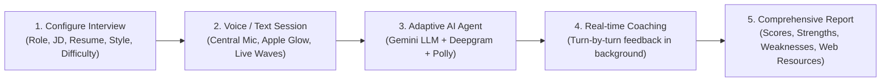

# Project 08: V1 AI Interview Agent Integration Plan

**Goal:** Integrate, configure, and stand up our complete, production-ready Version 1.0 (V1) AI Mock Interview Agent inside `integrated-interview-agent/`, delivering an end-to-end working system with adaptive AI interviewing, real-time coaching, voice STT/TTS, resume upload, Supabase persistence, and a modern React frontend.

**Architecture:** Decoupled modern full-stack system: a Python 3.11 FastAPI backend orchestrating a multi-agent loop (`AgentSessionManager`, `InterviewerAgent`, `AgenticCoachAgent`) powered by Google Gemini, Deepgram STT, Amazon Polly TTS, Serper web search, and Supabase PostgreSQL with RLS, paired with a React 18 + Vite + Tailwind + shadcn/ui frontend communicating via REST and WebSockets.

**Tech Stack:** 
- **Backend:** Python 3.11, FastAPI, LangChain, Google Gemini, Deepgram SDK, Amazon Polly (Boto3), Supabase SDK, Pydantic, Uvicorn, PyPDF2, python-docx
- **Frontend:** React 18, Vite, TypeScript, Tailwind CSS, shadcn/ui, Radix UI, Axios, Lucide React
- **Database & Auth:** Supabase PostgreSQL with Row Level Security (RLS) + Supabase JWT Auth
- **Search & Coaching:** Serper API Google Search for real-time post-interview learning resources

**Spec Reference:** [`integrated-interview-agent/planning/v1/V1_SCOPE.md`](file:///C:/VsCode/Hope-Elite-Works/Sept-Project/integrated-interview-agent/planning/v1/V1_SCOPE.md)

---

## 1. What V1 Delivers (Features & Capabilities)

Once integrated and built, our V1 platform provides a complete, polished user workflow:



### Core Feature Inventory in V1:
1. **User Authentication & Profiles:**
   - Supabase JWT authentication (Register, Login, Token Refresh, Current User Profile).
   - Anonymous session support for instant practice without mandatory login.
   - Row Level Security (RLS) enforcing session isolation at the database level.
2. **Resume & Interview Customization:**
   - Multi-format resume extraction (PDF, DOCX, TXT) feeding candidate background directly into LLM prompt context.
   - Targeted job role, optional company name, and job description input.
   - 4 Interview Styles (`Formal`, `Casual`, `Aggressive`, `Technical`).
   - 3 Difficulty Tiers (`Easy`, `Medium`, `Hard`).
   - Time-based pacing (`INTRO` 10%, `MAIN` 70%, `WRAPPING_UP` 15%, `OVERTIME` 5%) or target question counts.
3. **Adaptive Multi-Agent Engine:**
   - **`AgentSessionManager` (Orchestrator):** Coordinates the interview lifecycle, event bus, conversation history, and background tasks.
   - **`InterviewerAgent`:** Conducts the interview using Google Gemini via LangChain, generating personalized questions and context-aware follow-ups based on candidate responses.
   - **`AgenticCoachAgent`:** Silently evaluates candidate answers turn-by-turn (clarity, confidence, substance) and generates an exhaustive post-interview evaluation report.
4. **Voice & Speech Intelligence:**
   - **Real-time STT:** Deepgram streaming WebSocket endpoint (`/speech/stream-stt`) with interim results, punctuate, and endpointing.
   - **High-Fidelity TTS:** Amazon Polly neural synthesis (`generative` or `long-form` engine) with SSML enhancement and in-memory audio caching.
5. **Personalized Learning Engine:**
   - Coach Agent identifies candidate weakness areas from the transcript.
   - Automated Serper web search discovers targeted high-quality articles, videos, and documentation.
   - Returns curated resource recommendations with justifications for each candidate.
6. **Frontend Experience:**
   - Dark-mode aesthetic with Apple Intelligence-style glow effects, dynamic audio waveforms, and glassmorphism.
   - Full-featured interview cockpit with expandable transcript drawer, live coaching feedback indicator, and post-interview analytics dashboard.

---

## 2. Global Constraints & Standards

- **Python Version:** 3.11 (virtual environment at `backend/venv` or workspace `venv`).
- **Node Version:** Node.js 18+ with npm.
- **Backend Port:** `http://localhost:8000`.
- **Frontend Port:** `http://localhost:5173` (Vite dev server) or `8080`.
- **State Isolation:** Per-session `asyncio.Lock` via `ThreadSafeSessionRegistry` to prevent concurrency collisions.
- **POV Protocol:** Strict User POV in all code comments, docstrings, commits, and documentation.

---

## 3. Implementation Tasks

### Task 1: Clean Backend Directory & Port Core Source
**Files:**
- Create: `integrated-interview-agent/backend/main.py`
- Create: `integrated-interview-agent/backend/config.py`
- Create: `integrated-interview-agent/backend/requirements.txt`
- Create: `integrated-interview-agent/backend/.env.example`
- Create: `integrated-interview-agent/backend/agents/*`
- Create: `integrated-interview-agent/backend/api/*`
- Create: `integrated-interview-agent/backend/database/*`
- Create: `integrated-interview-agent/backend/middleware/*`
- Create: `integrated-interview-agent/backend/schemas/*`
- Create: `integrated-interview-agent/backend/services/*`
- Create: `integrated-interview-agent/backend/utils/*`

**Interfaces:**
- Consumes: Verified source files from `References/AI-Interview-Agent/backend/`.
- Produces: Complete FastAPI backend tree inside `integrated-interview-agent/backend/`.

- [ ] **Step 1: Clean stale cache files in `integrated-interview-agent/backend`**
  Remove orphaned `.pyc` and `__pycache__` artifacts from `integrated-interview-agent/backend`.
- [ ] **Step 2: Copy backend codebase from reference**
  Sync all Python modules, schemas, services, agents, API routers, database managers, and utilities from `References/AI-Interview-Agent/backend/` into `integrated-interview-agent/backend/`.
- [ ] **Step 3: Copy test suite**
  Sync `References/AI-Interview-Agent/backend/tests/` into `integrated-interview-agent/backend/tests/`.
- [ ] **Step 4: Verify backend file presence**
  Check that `main.py`, `requirements.txt`, and all module packages exist and contain non-zero bytes.

---

### Task 2: Port Frontend Source & Dependencies
**Files:**
- Create: `integrated-interview-agent/frontend/package.json`
- Create: `integrated-interview-agent/frontend/vite.config.ts`
- Create: `integrated-interview-agent/frontend/tsconfig.json`
- Create: `integrated-interview-agent/frontend/tailwind.config.ts`
- Create: `integrated-interview-agent/frontend/postcss.config.js`
- Create: `integrated-interview-agent/frontend/src/*`
- Create: `integrated-interview-agent/frontend/public/*`
- Create: `integrated-interview-agent/frontend/.env.example`

**Interfaces:**
- Consumes: Complete React/Vite source from `References/AI-Interview-Agent/frontend/`.
- Produces: Working React SPA inside `integrated-interview-agent/frontend/`.

- [ ] **Step 1: Copy frontend codebase from reference**
  Sync all configuration files, components, hooks, services, contexts, pages, styles, and assets from `References/AI-Interview-Agent/frontend/` into `integrated-interview-agent/frontend/`.
- [ ] **Step 2: Verify frontend configuration**
  Verify `package.json`, `vite.config.ts`, `tsconfig.json`, and `src/App.tsx` are correctly configured.

---

### Task 3: Port Infrastructure & Deployment Assets
**Files:**
- Create: `integrated-interview-agent/Dockerfile`
- Create: `integrated-interview-agent/start.sh`
- Create: `integrated-interview-agent/vercel.json`
- Create: `integrated-interview-agent/.dockerignore`
- Create: `integrated-interview-agent/setup_guide.md`
- Create: `integrated-interview-agent/AZURE_DEPLOYMENT_CHECKLIST.md`
- Create: `integrated-interview-agent/FRONTEND_DOCUMENTATION.md`
- Create: `integrated-interview-agent/BACKEND_DOCUMENTATION.md`
- Create: `integrated-interview-agent/no_stage.bat`
- Create: `integrated-interview-agent/run_venv.bat`

**Interfaces:**
- Consumes: Containerization and documentation files from `References/AI-Interview-Agent/`.
- Produces: Standalone deployment and local run scripts in `integrated-interview-agent/`.

- [ ] **Step 1: Copy Dockerfile and startup scripts**
  Copy `Dockerfile`, `start.sh`, `.dockerignore`, and `vercel.json`.
- [ ] **Step 2: Copy setup scripts and documentation**
  Copy `no_stage.bat`, `run_venv.bat`, `setup_guide.md`, `FRONTEND_DOCUMENTATION.md`, and Azure checklists.

---

### Task 4: Configure Local Environment & Dependencies
**Files:**
- Modify: `integrated-interview-agent/backend/.env`
- Modify: `integrated-interview-agent/frontend/.env.local`

**Interfaces:**
- Consumes: API keys (Gemini, Supabase, Deepgram, AWS, Serper) from existing root or template.
- Produces: Valid local runtime configs for both frontend and backend.

- [ ] **Step 1: Setup backend `.env`**
  Generate `integrated-interview-agent/backend/.env` from `.env.example`, preserving existing credentials from root/reference if present.
- [ ] **Step 2: Setup frontend `.env.local`**
  Configure `VITE_API_BASE_URL="http://localhost:8000"`, `VITE_SUPABASE_URL`, and `VITE_SUPABASE_ANON_KEY`.
- [ ] **Step 3: Install/Verify Python dependencies in virtual environment**
  Verify required packages (`fastapi`, `langchain-google-genai`, `supabase`, `deepgram-sdk`, `boto3`, etc.) are installed in the workspace environment.
- [ ] **Step 4: Install frontend dependencies**
  Run `npm install` in `integrated-interview-agent/frontend`.

---

### Task 5: Automated Verification & Unit Test Suite
**Files:**
- Test: `integrated-interview-agent/backend/tests/*`

**Interfaces:**
- Consumes: Pytest test runner.
- Produces: Verified test results for agents, services, rate limiters, and session management.

- [ ] **Step 1: Run agent unit tests**
  Execute `pytest backend/tests/agents/ -v` from `integrated-interview-agent`.
- [ ] **Step 2: Run services & utils tests**
  Execute `pytest backend/tests/services/ backend/tests/utils/ -v`.
- [ ] **Step 3: Run session and concurrency tests**
  Execute `pytest backend/tests/test_phase_1.py backend/tests/test_phase_4.py -v`.

---

### Task 6: End-to-End Runtime Validation
**Files:**
- Execute: `integrated-interview-agent/backend/main.py`
- Execute: `integrated-interview-agent/frontend`

**Interfaces:**
- Consumes: Running Uvicorn server and Vite dev server.
- Produces: Verified healthy API responses and compiled frontend build.

- [ ] **Step 1: Start backend server and verify health endpoint**
  Start `uvicorn backend.main:app --port 8000` and query `GET http://localhost:8000/health`.
  Expected: HTTP 200 with status `healthy` and service diagnostics.
- [ ] **Step 2: Verify interview session creation via API**
  Send `POST http://localhost:8000/interview/session` with sample job role and verify `session_id` returned.
- [ ] **Step 3: Build frontend and verify zero build errors**
  Run `npm run build` in `integrated-interview-agent/frontend`.
  Expected: Clean build without TypeScript or bundling errors.

---

## 4. Verification Plan

### Automated Verification
```bash
# 1. Run all backend unit tests
cd integrated-interview-agent/backend
pytest tests/agents/ tests/services/ tests/utils/ -v

# 2. Test FastAPI health endpoint
curl http://localhost:8000/health

# 3. Test Frontend build
cd ../frontend
npm run build
```

### Manual Verification
1. Open `http://localhost:5173` in the browser.
2. Verify the Landing Page renders with animated hero and interview configuration form.
3. Configure an interview: Role = "Full Stack Engineer", Difficulty = "Medium", Style = "Technical".
4. Click "Start Interview" and verify the Voice-First cockpit loads with the Central Mic button and initial greeting question.
5. Provide a test response and verify turn-by-turn coach feedback and next question generation.
6. Click "End Interview" and verify the post-interview report displays overall performance, strengths, weaknesses, and curated web search recommendations.
