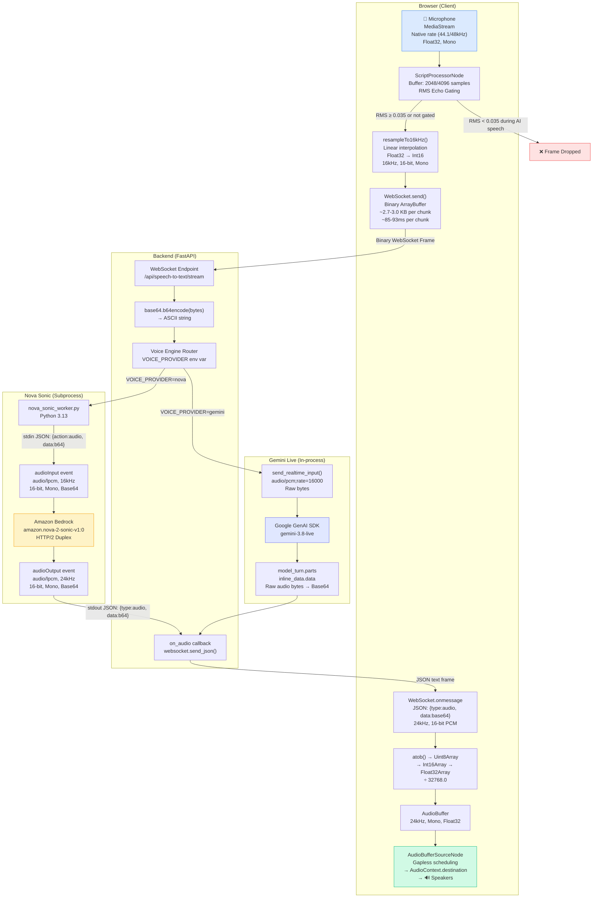
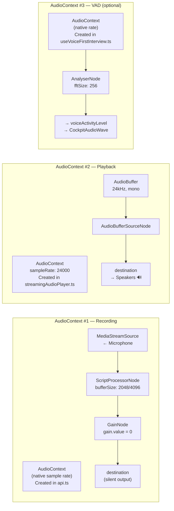

# VOICE DATA FLOW

> Exact audio data formats at every stage of the pipeline.

---

## End-to-End Audio Data Flow

---

## Format at Each Stage

| Stage | Sample Rate | Bit Depth | Channels | Format | Container | Size per ~85ms |
|---|---|---|---|---|---|---|
| Microphone output | 44.1/48 kHz | 32-bit float | 1 | IEEE 754 Float32 | MediaStream | 4096 × 4 = 16,384 bytes |
| After resampling | 16 kHz | 16-bit int | 1 | Signed Int16 (PCM) | Int16Array | ~1,365–1,482 × 2 ≈ 2,730–2,964 bytes |
| WebSocket uplink | 16 kHz | 16-bit int | 1 | Raw PCM | Binary ArrayBuffer | ~2,730–2,964 bytes |
| Backend → Worker | 16 kHz | 16-bit int | 1 | Base64 PCM | JSON line (stdin) | ~3,640–3,952 chars (base64) |
| Bedrock input | 16 kHz | 16-bit int | 1 | Base64 PCM | HTTP/2 event | Same as above |
| Bedrock output | **24 kHz** | 16-bit int | 1 | Base64 PCM | HTTP/2 event | Provider-determined |
| Gemini input | 16 kHz | 16-bit int | 1 | Raw PCM bytes | WebSocket | ~2,730–2,964 bytes |
| Gemini output | **24 kHz** *(assumed)* | 16-bit int | 1 | Raw bytes → Base64 | WebSocket | Provider-determined |
| WebSocket downlink | 24 kHz | 16-bit int | 1 | Base64 in JSON | Text WebSocket frame | Variable |
| Browser decode | 24 kHz | 32-bit float | 1 | IEEE 754 Float32 | AudioBuffer | Variable |
| Speaker playback | 24 kHz | 32-bit float | 1 | Float32 | AudioBufferSourceNode | Gapless scheduled |

---

## Dual Audio Context Architecture

The browser maintains **two separate AudioContext instances** for different purposes:

> [!WARNING]
> The VAD AudioContext (#3) creates a **separate** `getUserMedia()` call and `MediaStream`, duplicating the microphone access already obtained by AudioContext #1. This is a potential resource waste and could cause permission issues on some browsers.

---

## Asymmetric Sample Rates

| Direction | Sample Rate | Reason |
|---|---|---|
| **Uplink** (mic → provider) | **16 kHz** | Provider requirement (both Nova Sonic and Gemini expect 16kHz input) |
| **Downlink** (provider → speaker) | **24 kHz** | Provider output (Nova Sonic outputs at 24kHz; Gemini assumed same based on player config) |

This asymmetry is intentional and correct — speech recognition models typically process 16kHz input, while speech synthesis outputs at higher quality 24kHz.
