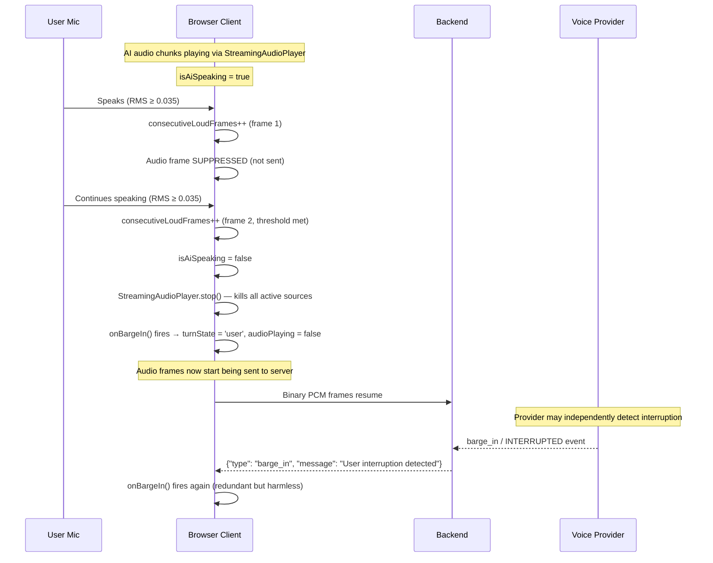

# VOICE FAILURE MATRIX

> Current behavior for every failure scenario, derived from source code.

---

## Part 6 — Interruption / Barge-In Scenarios

### Scenario 1: AI is speaking and user starts speaking

**CURRENT BEHAVIOR:** Client-side barge-in acts immediately (stops playback). Server-side barge-in arrives later as confirmation.
**RACE CONDITION:** Two barge-in signals (client + server) fire independently. Client acts first. Server barge-in is redundant but calls `onBargeIn()` again (harmless — playback already stopped).

### Scenario 2: User interrupts halfway through AI speech

**CURRENT BEHAVIOR:** Same as Scenario 1. All scheduled `AudioBufferSourceNode` instances are stopped immediately via `source.stop()`. Any buffered-but-unplayed audio chunks are discarded. Provider stops generating audio.

### Scenario 3: User stops speaking

**CURRENT BEHAVIOR:** Provider performs server-side silence detection (native turn detection). When provider determines user has finished:
1. Provider sends final user transcript (`is_final: true`)
2. Provider sends `turn_ended` event
3. Provider begins generating AI response
No client-side silence detection or VAD-based turn end.

### Scenario 4: AI receives partial input

**CURRENT BEHAVIOR:** Provider processes audio in real-time. Partial/interim transcripts are emitted continuously. If user stops mid-sentence, provider's turn detection will eventually trigger after its silence threshold is met.

### Scenario 5: User speaks immediately after AI finishes

**CURRENT BEHAVIOR:** 200ms cooldown period (`lastAiSpeechEndTime`). During this window, audio frames with RMS < 0.035 are still suppressed (preventing echo tail). Frames with RMS ≥ 0.035 pass through immediately. This means if the user starts speaking loudly within 200ms, audio will be sent. If they start speaking softly, there may be a brief gap.

### Scenario 6: User speaks while previous audio is still buffered

**CURRENT BEHAVIOR:** If `StreamingAudioPlayer.activeSources` has scheduled-but-not-yet-playing sources and user speaks:
- Client barge-in detection triggers (RMS check)
- `stop()` kills all sources including not-yet-started ones
- Scheduled future audio is discarded
- No partial playback of in-flight chunks

**RACE CONDITION:** Audio chunks arriving via WebSocket after `stop()` is called will create new `AudioBufferSourceNode` instances and start playing. The `onAudioChunk` callback in `useVoiceFirstInterview.ts` does NOT check if barge-in just occurred — it unconditionally calls `audioPlayerRef.current.playChunk(base64Audio)` and sets `isAiSpeaking = true`.

> [!CAUTION]
> **Race condition identified:** After client-side barge-in, in-flight audio chunks from the WebSocket can arrive and restart playback before the server-side barge-in event arrives to stop the provider. The `onAudioChunk` handler does not guard against this.

---

## Part 7 — Failure Cases

### Microphone & Browser Audio

| Failure | Current Behavior | Current Handling | Missing Handling |
|---|---|---|---|
| **Microphone permission denied** | `getUserMedia()` rejects | `startVoiceRecognition()` catches → toast "Could not access your microphone" + calls `stopVoiceRecognition()` | No retry mechanism; no guidance on how to grant permission |
| **Microphone unavailable** | `getUserMedia()` rejects | Same as permission denied — generic catch | No differentiation between "denied" vs "not found" vs "in use by another app" |
| **Browser audio API failure** | Web Audio API unavailable | Falls back to `MediaRecorder({ mimeType: 'audio/webm' })` | MediaRecorder sends encoded WebM blobs, but backend expects raw PCM → **backend will receive incompatible data** |
| **Malformed audio** | Corrupt Float32Array data | No validation — forwarded as-is | No checksum or format validation on either side |
| **Empty audio** | All-zero samples | Sent to provider (passes RMS check since RMS=0 < threshold → gated during AI speech, but passes when idle) | Provider receives silence; wastes bandwidth |
| **Silence** | Continuous silence (user not speaking) | Sent continuously while mic is active; provider's native turn detection handles | No client-side silence timeout; audio streams indefinitely |
| **Very long speech** | Candidate speaks for minutes | Audio streamed continuously. 8-minute Nova Sonic renewal handles connection limit | No transcript size limit; no speech duration warning |

### Network Failures

| Failure | Current Behavior | Current Handling | Missing Handling |
|---|---|---|---|
| **Network latency** | Audio chunks arrive late | No handling — chunks processed on arrival | No jitter buffer; no reordering; no chunk timestamping |
| **Network disconnect** | WebSocket closes | `ws.onclose` fires → `onDisconnected()` → `microphoneActive = false`, `turnState = 'idle'` | **No reconnection logic**. `reconnectAttempts` exists but is never used. Session state may be lost |
| **Intermittent connection** | Packet loss | Some audio frames lost silently | No detection of dropped frames; no quality degradation feedback |
| **Network reconnect** | User must manually restart | Not implemented | No automatic reconnect; no session resumption |

### WebSocket Failures

| Failure | Current Behavior | Current Handling | Missing Handling |
|---|---|---|---|
| **WebSocket disconnect** | Connection closes | Server: `WebSocketDisconnect` caught → `engine.close_session()` + `db_manager.update_speech_task()`. Client: `onDisconnected()` fires | No reconnect. No session state preservation for resume |
| **WebSocket error during open** | `ws.onerror` fires | `connectWebSocket()` rejects Promise → `startVoiceRecognition()` catches → toast error | No retry with backoff |
| **WebSocket message parse error** | `JSON.parse()` throws | Caught in `onmessage` handler → `console.error` | Silently drops the message; no notification to user |
| **WebSocket send failure** | `send()` throws | In server callbacks: wrapped in `try/except: pass` (silently ignored) | Server doesn't know if client received the message |

### Backend Failures

| Failure | Current Behavior | Current Handling | Missing Handling |
|---|---|---|---|
| **Backend restart** | WebSocket connection drops | Client receives `onclose` → same as disconnect | No session recovery. User must start a new interview |
| **Backend crash during session** | WebSocket drops + engine session orphaned | Engine session dict entry remains; no cleanup without explicit close | Orphaned sessions leak memory until process restart |
| **Session not found** | `get_session_manager()` returns None | System prompt is empty string; interview runs without context | No error message to client; interview proceeds with degraded quality |
| **Database unavailable** | `db_manager.create_speech_task()` fails | Caught: `speech_task_id = None`, continues without task tracking | Speech task not tracked; no audit trail |

### Voice Provider Failures

| Failure | Current Behavior | Current Handling | Missing Handling |
|---|---|---|---|
| **Nova Sonic: AWS credentials invalid** | Worker enters simulated mode | Emits `{"type": "warning"}` with "PROTOCOL TEST MODE" message. Generates synthetic sine tones and hardcoded transcripts | Client receives fake audio/transcripts without clear indication to user that this is not a real interview |
| **Nova Sonic: Bedrock connection fails** | Worker enters simulated mode | Same as above — silent degradation to simulation | No fallback to Gemini; no user notification that interview is simulated |
| **Nova Sonic: Worker process crash** | `stdout` closes | `_read_worker_output()` loop breaks on empty bytes | `on_error` not called; client may hang waiting for audio |
| **Gemini: API key missing** | `start()` returns False | `on_error("GEMINI_VOICE_API_KEY not configured")` fires | Error propagated to client as toast; interview cannot proceed |
| **Gemini: Live session error** | Exception in `_receive_loop()` | Caught → `on_error("Gemini Live stream error: ...")` | No automatic retry; session ends |
| **Provider timeout** | Provider stops responding | No timeout mechanism | No detection; client and server wait indefinitely |
| **Provider rate limit** | Provider rejects requests | Provider-specific error propagated via `on_error` | No backoff; no queue; no user-friendly message |
| **Malformed provider response** | Unexpected event structure | `getattr()` with defaults; JSON decode errors caught | Silently ignored; potential data loss |

### Browser State Failures

| Failure | Current Behavior | Current Handling | Missing Handling |
|---|---|---|---|
| **Browser tab suspension** | Browser throttles/suspends JavaScript | `AudioContext` may suspend; `requestAnimationFrame` stops | No detection of suspension; audio playback may stall; no resume logic |
| **User refresh** | Page reloads | `useEffect` cleanup runs `stopVoiceRecognition()` | WebSocket closes; server-side cleanup via `finally` block. Interview state lost unless previously saved to DB |
| **User closes tab** | Window closes | `beforeunload` handler fires `fetch(POST /interview/session/cleanup, { keepalive: true })` | Cleanup request may or may not succeed (browser best-effort). Engine session cleanup depends on WebSocket close detection |
| **Duplicate events** | Same event received twice | No deduplication logic | Transcript may accumulate duplicates; audio chunks may play twice |
| **Delayed events** | Events arrive out of order | No reordering logic | May cause inconsistent UI state (e.g., `turn_ended` before final transcript) |

---

## Critical Race Conditions Summary

| # | Race Condition | Impact | Severity |
|---|---|---|---|
| 1 | **Post-barge-in audio arrival** | Audio chunks in WebSocket buffer play after barge-in stop | 🟡 Medium — causes brief AI speech playback after interruption |
| 2 | **Dual barge-in signals** | Client barge-in + server barge-in fire independently | 🟢 Low — redundant but harmless |
| 3 | **Stop during audio playback** | `stopVoiceRecognition()` stops player, but in-flight `onAudioChunk` callbacks may restart it | 🟡 Medium — may cause brief audio after stop |
| 4 | **Transcript accumulation during stop** | `onTranscript` may fire after `stopVoiceRecognition()` has read `accumulatedTranscriptRef` | 🟡 Medium — may lose final transcript words |
| 5 | **Session manager save during mutation** | `SessionSavingMiddleware` fires `asyncio.create_task` save while session is being mutated | 🟢 Low — per-session locks mitigate this |
| 6 | **MediaRecorder fallback sends wrong format** | If Web Audio fails, MediaRecorder sends `audio/webm` but backend expects raw PCM | 🔴 High — backend will forward incompatible data to provider |
