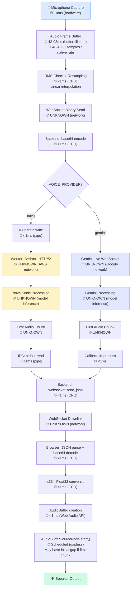

# VOICE LATENCY FLOW

> Latency analysis of the real-time voice pipeline. Only reports measurements that exist in code.

---

## Latency Path Breakdown



---

## Segment Analysis

| Segment | Estimated Latency | Measured? | Source |
|---|---|---|---|
| **Microphone hardware → MediaStream** | ~0ms | ❌ No | Depends on audio driver |
| **Buffer fill time** | **42–93ms** | ❌ No (derivable) | `bufferSize / sampleRate`: 4096/48000=85ms, 2048/44100=46ms, 4096/44100=93ms |
| **RMS check + resampling** | <1ms | ❌ No | CPU-bound linear interpolation |
| **Client → Server (network uplink)** | **UNKNOWN** | ❌ No | Depends on network conditions |
| **Backend base64 encode** | <1ms | ❌ No | In-memory operation |
| **IPC stdin write (Nova)** | <1ms | ❌ No | Pipe write |
| **Network to AWS Bedrock** | **UNKNOWN** | ❌ No | Depends on region proximity |
| **Nova Sonic model inference** | **UNKNOWN** | ❌ No | First-token latency not measured |
| **Network to Gemini** | **UNKNOWN** | ❌ No | Depends on network |
| **Gemini model inference** | **UNKNOWN** | ❌ No | First-token latency not measured |
| **First audio chunk generation** | **UNKNOWN** | ❌ No | Time from end-of-user-speech to first provider audio byte |
| **IPC stdout read (Nova)** | <1ms | ❌ No | Pipe read |
| **Backend → Client (network downlink)** | **UNKNOWN** | ❌ No | Depends on network conditions |
| **Browser JSON parse + decode** | <1ms | ❌ No | CPU-bound |
| **Audio scheduling gap** | **0ms (gapless)** for subsequent chunks; **variable** for first chunk | ❌ No | `max(currentTime, nextPlayTime)` |
| **Speaker DAC latency** | ~5–20ms | ❌ No | Hardware/OS dependent |

---

## Currently Measured Latencies

The codebase measures **exactly one** latency value:

| Measurement | Location | What It Measures |
|---|---|---|
| **TTS synthesis time** | [`useVoiceFirstInterview.ts`](file:///C:/VsCode/Hope-Elite-Works/Sept-Project/integrated-interview-agent/frontend/src/hooks/useVoiceFirstInterview.ts) L448–L452 | `Date.now()` before `api.textToSpeech()` call to `Date.now()` after blob received. **But this TTS path is currently disabled** (auto-TTS early return at L525) |

> [!CAUTION]
> **Zero latency instrumentation exists for the active real-time voice path.** The only measurement in the codebase is for the disabled Polly TTS fallback.

---

## Missing Instrumentation

### Critical (must have for optimization)

| What to Measure | Where to Instrument | Why It Matters |
|---|---|---|
| **End-of-user-speech → First AI audio byte** | Timestamp at `turn_ended(user)` vs first `audio` event | This is the perceived "thinking time" — the #1 user-facing latency metric |
| **First audio byte → Speaker output** | Timestamp at `onAudioChunk` callback vs `AudioBufferSourceNode.start()` | Measures browser-side processing pipeline |
| **Total round-trip latency** | From last user audio frame sent to first AI audio byte received at browser | Overall system responsiveness |
| **WebSocket send-to-receive for audio chunks** | Timestamps on binary send vs JSON receive | Network contribution to latency |

### Important (needed for debugging)

| What to Measure | Where to Instrument | Why It Matters |
|---|---|---|
| **Resampling time** | Around `resampleTo16kHz()` | Verify CPU overhead of per-frame resampling |
| **Provider connection setup time** | Around `engine.create_session()` | Time to first usability after user clicks mic |
| **8-minute renewal gap** | Duration between old stream close and new stream ready | User will hear silence during renewal |
| **Barge-in response time** | From user loud frame detection to AI audio stoppage | Perceived interruption responsiveness |
| **Audio buffer underrun events** | In `StreamingAudioPlayer` when `currentTime > nextPlayTime` | Indicates audio gaps/stuttering |

### Nice to Have

| What to Measure | Where to Instrument | Why It Matters |
|---|---|---|
| **Audio chunk jitter** | Inter-arrival time variance of `audio` events | Network stability indicator |
| **WebSocket reconnection time** | If/when reconnect is implemented | Recovery time metric |
| **ScriptProcessorNode callback jitter** | Time between consecutive `onaudioprocess` callbacks | Browser audio scheduling health |

---

## Estimated Total User-Perceived Latency

> [!WARNING]
> These are **rough estimates**, NOT measured values.

```
Buffer fill:        ~85ms   (4096 @ 48kHz)
Network uplink:     ~20-100ms (depends on deployment)
Provider inference:  ~300-1500ms (first-token latency, model-dependent)
Network downlink:   ~20-100ms
Browser processing: ~2ms
Audio scheduling:   ~0-10ms

ESTIMATED TOTAL:    ~427ms to ~1,797ms
```

The dominant factor is **provider inference time** — the time for the AI model to begin generating audio after receiving the user's complete turn. This is entirely controlled by the provider and varies per turn complexity.
