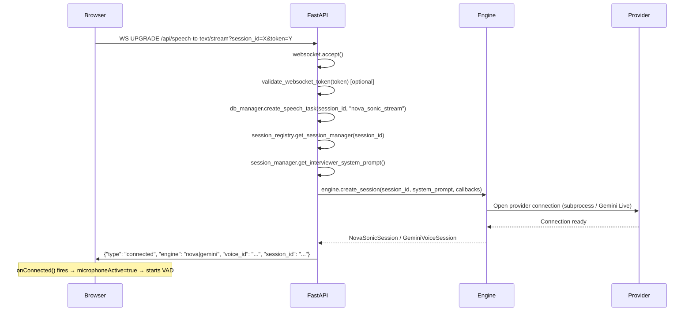
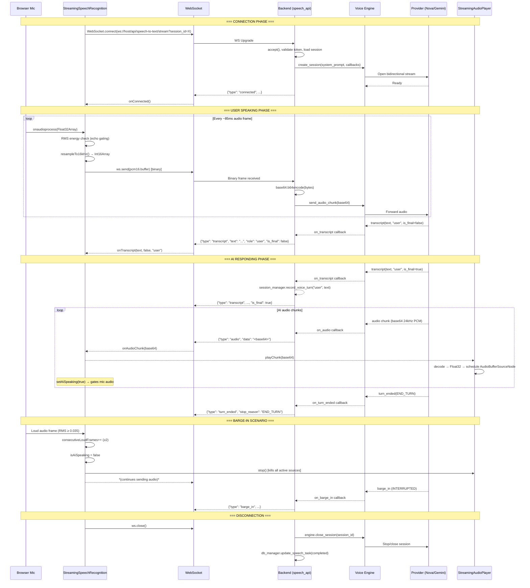
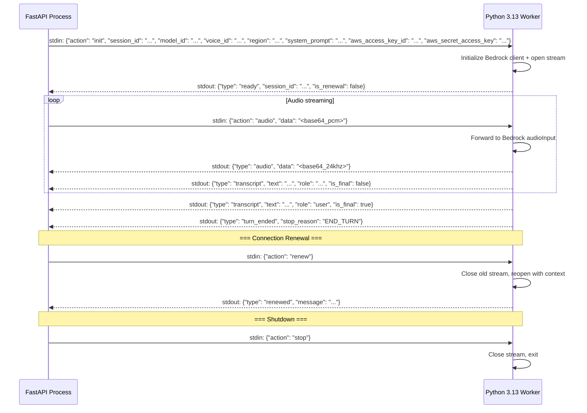

# VOICE WebSocket FLOW

> Complete WebSocket protocol trace derived from source code.

---

## Connection Establishment

### Connection Details

| Property | Value |
|---|---|
| **URL** | `ws://<host>:8000/api/speech-to-text/stream` (primary) or `/api/voice/nova-sonic/stream` (alias) |
| **Query Params** | `session_id` (optional), `token` (optional JWT) |
| **Handshake** | Standard WebSocket upgrade; no custom headers during handshake |
| **Authentication** | JWT token validated via `validate_websocket_token()` — decodes with `SUPABASE_JWT_SECRET`, checks expiry, retrieves user from DB. **Optional**: connection proceeds even if token is absent or invalid |
| **Binary Type** | Client sets `ws.binaryType = 'arraybuffer'` |

---

## Message Types

### CLIENT → SERVER Messages

| # | Format | Event / Type | Payload Schema | Purpose |
|---|---|---|---|---|
| 1 | **Binary** | *(raw PCM)* | `ArrayBuffer` containing Int16 samples at 16kHz mono | Stream microphone audio to voice provider |
| 2 | **JSON** | `"audio"` | `{"type": "audio", "data": "<base64_pcm>"}` | Alternative audio transport (not primary path) |
| 3 | **JSON** | `"renew"` | `{"type": "renew"}` | Request 8-minute Nova Sonic connection renewal |
| 4 | **JSON** | `"stop"` | `{"type": "stop"}` | Clean shutdown of voice session |

### SERVER → CLIENT Messages

| # | Type | Payload Schema | Purpose |
|---|---|---|---|
| 1 | `"connected"` | `{"type": "connected", "engine": "nova\|gemini", "voice_id": string, "session_id": string}` | Confirm connection established |
| 2 | `"audio"` | `{"type": "audio", "data": "<base64_24khz_pcm>"}` | Stream AI speech audio chunk |
| 3 | `"transcript"` | `{"type": "transcript", "text": string, "role": "user\|assistant", "is_final": boolean}` | Real-time speech transcript |
| 4 | `"barge_in"` | `{"type": "barge_in", "message": "User interruption detected"}` | AI speech interrupted by user |
| 5 | `"turn_ended"` | `{"type": "turn_ended", "stop_reason": "END_TURN"}` | AI turn completed |
| 6 | `"renewed"` | `{"type": "renewed", "message": "Nova Sonic connection renewed successfully."}` | Connection renewed (Nova Sonic only) |
| 7 | `"error"` | `{"type": "error", "error": string}` | Error notification |
| 8 | `"interview_ending"` | `{"type": "interview_ending", "state": object}` | Interview should conclude |

---

## Full Session Flow

---

## Connection Lifecycle

| Phase | Current Implementation |
|---|---|
| **Heartbeat / Ping-Pong** | **NONE** — No application-level heartbeat. Relies on WebSocket protocol-level ping/pong (if supported by Starlette/uvicorn) |
| **Ordering** | Messages are ordered within a single WebSocket connection (TCP guarantees) |
| **Buffering** | No explicit buffering on server side; `asyncio.subprocess.PIPE` buffers internally for Nova Sonic worker IPC |
| **Backpressure** | **NONE** — No flow control mechanism. Audio chunks are forwarded as fast as received |
| **Disconnect detection** | Server: `WebSocketDisconnect` exception or `msg["type"] == "websocket.disconnect"`. Client: `ws.onclose` event |
| **Reconnect** | **NOT IMPLEMENTED** — `reconnectAttempts` and `maxReconnectAttempts` exist in client code but no reconnection logic is implemented |
| **Timeout** | **NONE** — No idle timeout on the WebSocket. Nova Sonic has 8-minute connection renewal. Gemini: managed by provider |
| **Cancellation** | Client sends `{"type": "stop"}` or closes WebSocket. Server enters `finally` block and closes engine session |
| **Cleanup** | Server: `engine.close_session()` + `db_manager.update_speech_task()`. Client: stops mic tracks, closes AudioContext, nullifies refs |

---

## IPC Protocol (Nova Sonic Worker)

